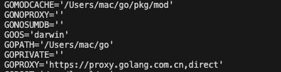
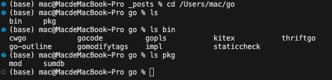
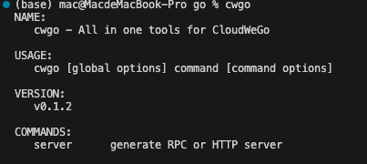

在mac中使用`go install`下载工具后，使用cil使用工具会出现`command not found`提示。
使用网上各种方案后，总结可能的通用方案。
1. 使用命令
```bash
go env
```
查看go环境，找到`GOPATH`一栏（go install的内容会放在该目录下）

2. 为了更具体到了解到GOPATH里存的是什么，我们cd看一下

可以看到bin目录下有我们下载的命令（如果下载成功）
3. 将bin目录写到我们的PATH中，我这里使用的是zsh的配置文件：
```bash
vim ~/.zshrc
```
然后写入
```bash
PATH=$PATH:/Users/mac/go/bin
```

之后重新载入.zshrc，就可以全局使用命令了
```bash
source ~/.zshrc
```
