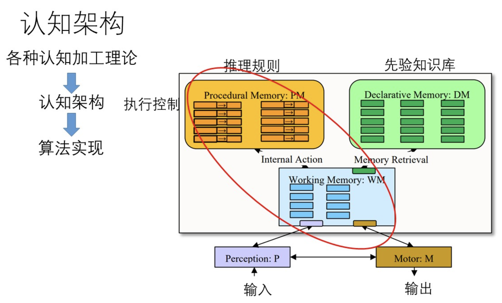
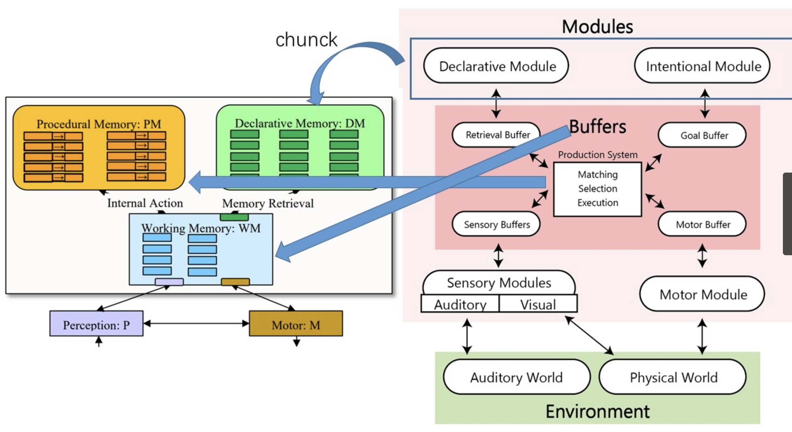
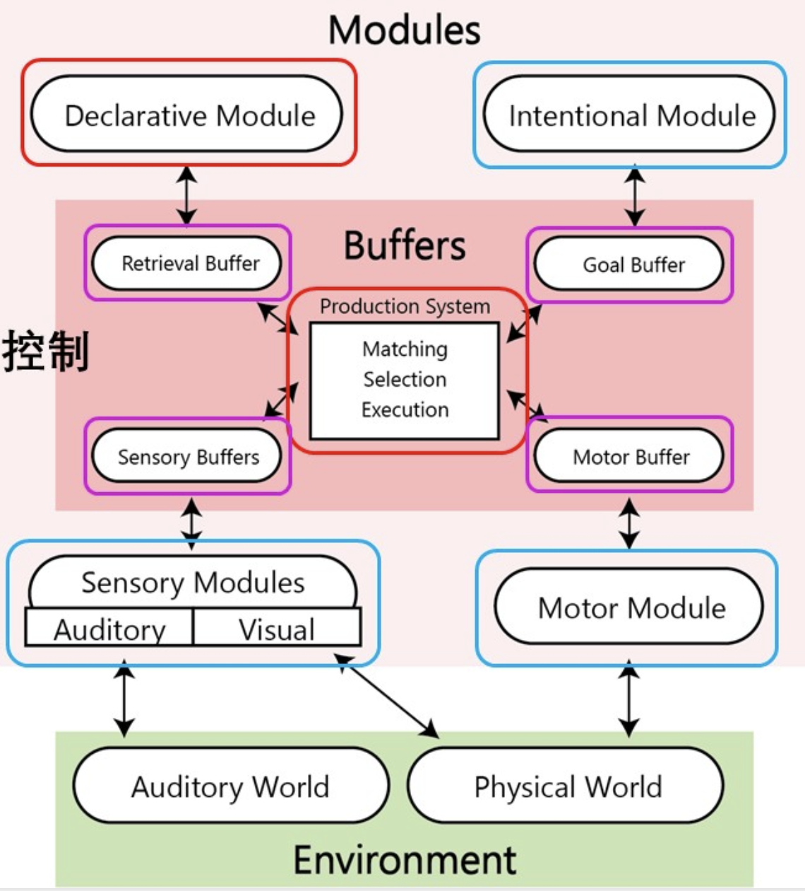
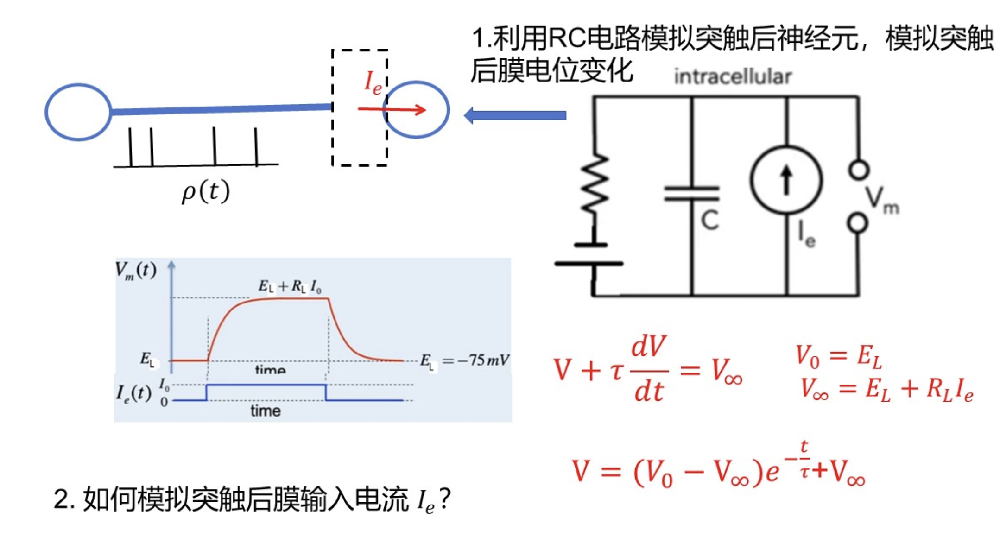

# 1. 绪论

|  主体  | 结构 | 功能 |
| ----- | ---- | ----|
| 计算机 | 硬件 | 软件 |
| 脑 | 神经元 | 认知加工 |

- 类脑（结构）
- 认知（功能）
- 类脑 + 计算 -> 类脑智能
- 认知 + 计算 -> 认知智能

---


- 智能
    - 心理能力
        - 从经验中学习的能力
        - 理解和处理抽象概念的能力
        - 使用知识**操纵**环境的能力
        - 适应环境的能力

- 认知
    - 指人们获取知识和应用知识的**心理过程**

- 计算
    - 广义计算：信息加工系统具有可计算性

    - 认知过程是否可计算
        - 心智哲学中的功能主义
            - 功能主义认为人类心智的物质载体时大脑
            - 心智时人脑的一种功能属性
            - 人脑类似于计算机
        - 心智可计算理论
            - 心智不仅包括认知，也包括意识现象以及人的主观感受性等。
        - 认知的可计算理论
            - 认为神经元活动仅仅解释认知
            - CTC认为心智的某些方面具有不可计算性流出可能性
        
- 认知计算
    - 用信息处理的方法模拟**人的各种认知加工过程**。

- 人工智能与认知科学
    - 认知科学
        - 非常重视认知模型的可解释性，而不是预测。
        - 如何利用认知模型帮助我们理解人类的认知加工机制。
    - 人工智能
        - 关注技术的性能，忽略可解释性。

    | 认知研究范式 | 三大学派 |
    | ----------- | -------- |
    | 符号范式 |  符号主义 |
    | 联结主义范式 | 联结主义 |
    | 具身智能范式 | 行为主义 |

- 计算神经科学：综合数学建模、理论分析及计算模拟等方法，阐明神经系统发育、生理过程和认知能力产生的基本原理。
    - 计算
        - 研究神经系统信息处理中的计算过程
        - 构建计算模型模拟神经系统

- 认知神经科学：认知+神经
    - 旨在阐明认知活动的脑机制
    - 宏观和微观两个研究层次
        - 宏观：脑皮层层次，认知加工的脑机制
        - 微观：分子神经细胞层次，认知加工的神经机制


# 2. 感知觉
### 感觉
- 五感：视听味嗅触
- 感觉是指感官器官（如眼睛、耳朵、皮肤等）接受和检测外界刺激的过程。
- 把外界的物理能量转化为神经信号，传递到各个感官对应的大脑皮层的过程。

- 感觉加工过程：以视觉为例
    - 光->视网膜->光感受器->双极细胞->节细胞->LGN->大脑皮层
- 感觉加工过程：**感觉器**将**物理刺激**转化为**生物电信号**，并通过**动作电位**把外界事件的信号传递到**大脑中枢特定区域**的过程。
    - 第一步：感觉信息的转录（光 ----> 双极细胞）
    - 第二步：编码为动作电位 （节细胞 ----> 初级视觉皮层）

### 感受性与感觉阈限
- 感觉性：感觉器官对刺激的感受能力。
- 感觉阈限：
    - 绝对感觉阈限：是指刚刚能够引起感觉的最小刺激量。

### 知觉
- 定义：认知系统对外界世界建构**内部表征**的过程。
- 知觉并不是对现实世界的精确表征


- 知觉加工过程
    - 大脑皮层内部发生
    - what通路（腹侧通路）：
        - 负责物体识别和形状分析
        - 从初级视觉皮层（V1）经过V2、V4到下颞叶皮层（IT）
        - 处理物体的形状、颜色、纹理等特征
        - 回答"这是什么？"的问题
    - where通路（背侧通路）：
        - 负责空间定位和运动分析
        - 从V1经过V2、MT到顶叶皮层
        - 处理物体的位置、运动、空间关系等信息
        - 回答"在哪里？"的问题
    
### 知觉的两种加工过程
- 自下而上：仅仅是环境刺激，不需要复杂的思维推理等
- 自上而下：个体运用自己已有的经验和概念来加工当前刺激的过程（高级知识的参与）

- 知觉的特性
    - 错觉：人们在观察物体时，由于物体受到形、光、色的干扰，加上人们的生理、心理原因而误认
    - 恒常性：当知觉的对象在一定范围内发生变化，知觉的映像仍然保持相对不变

### 模式识别
- 模式：由若干元素或特征按一定关系集合而成的某种刺激结构或刺激的组合。

- 模板匹配、原型匹配、特征匹配
    - 原型匹配 
        - 原型：一类客观事物的抽象物，是一类客观事物所共有的一组特征
        - 优点：减轻了记忆的负担；主导类别识别，实现快速分类与范畴化。
        - 缺陷：过渡依赖共性，忽略个体差异。
    - 特征匹配理论
        - 特征提取
        - 特征整合
        - 模式匹配
        - 优点：
            - 依据刺激的特征和关系进行识别，抗干扰性强
            - 特征复用，只需记住不同模式中特征间关系，减轻了记忆负担
            - 带有学习色彩

### 注意
- 注意的定义：注意是对心智的占用。是指对外在或内在环境的**某方面选择性指向和集中**，同时忽略其他方面的过程。
- 注意的特性：
    - 选择性
    - 分配性
    - 持续性
- 选择注意：
    - 自下而上注意与自上而下注意
        - 根据注意朝向的方式是内在还是外在的过程区分。
        - 自下而上注意（外源性注意）
            - 由外在视觉刺激的凸显物理属性引起的选择性注意。
            - 由外部刺激所驱动和控制，属于自下而上的加工。
            - 具有本能反应和自动加工的特性，属于自动化加工。
            - 属于反射性注意。
        - 自上而下注意
            - 根据观察者的行为目标和意图控制注意的朝向。

#### 选择注意的三种模型
1. 过滤模型（1958）
    - 注意是一种全或无的过滤器。
    - 过滤器在早期选择信息进行加工。
    - 未被注意的刺激特征完全被滤波器滤除。
    - 如何选择注意通道？
        - 可以采用自上而下的有意注意
        - 也可采用自下而上的反射注意
            - 刺激的凸显性

2. 注意的衰减模型

3. 后期选择模型
- 特征整合模型
    - 两个阶段：特征登记阶段、前注意阶段
    - 第二阶段：
        - 特征整合（物体知觉）
            - 形成位置地图
            - 选择注意
            - 集中注意
    - 全过程：特征提取->形成位置地图->选择注意->模式匹配
        
- 导向搜索模型
    - 特征整合模型没有考虑注意选择的方式，如何选择特定的位置。
    - 在特征整合理论基础上，增加了注意选择的方式。
    - 两个加工过程：
        - 特征加工过程
        - 生成激活映射图。
            - 自下而上：奇异刺激（具有搞得凸显性）
            - 自上而下：受特定的搜寻任务所指导
    - 全过程：特征提取->生成激活映射图->形成位置地图->选择注意->模式匹配

# 3. 记忆
- 记忆是个体保持和提取过去经验，并在当下应用这些信息的一种能力。
- 记忆的信息加工阶段
    - 信息编码、信息存储、信息提取
### 短时记忆与工作记忆
- 短时记忆
    - 在短时间内将少量信息保持在一种活跃的，容易获取的状态
- 工作记忆
    - 对信息短时间的存储
    - 操纵信息的能力
- 比较
    - 短时记忆仅有存贮功能
    - 工作记忆除了具备存贮能力之外，还具备操作功能
    - 工作记忆在语言推理和问题解决等高级认知过程中起着重要作用。
- 组块

### 长时记忆
- 在人脑中存储一分钟以上，乃至终身的记忆。
- 尝试记忆中所存储的信息是**过去经历**的经验和获取的知识。
- 短时记忆使个体应对当前的事物或时间，长时记忆使个体生活在过去与现在的世界中。
- 长时记忆系统
    - 陈述性记忆（信息提取方式：外显）
        - 对*事实和事件*的记忆
        - 语义记忆（关于事实的记忆）
        - 情景记忆（关于事件的记忆）
            - 与个人自身体验有关
            - 在特定时间与空间发生的情景或事件。
            - 发展较晚，退化较早
            - 记忆特性
                - 对时间的主观感觉
                - 以视觉图像的形式呈现
    - 程序性记忆（信息提取方式：内隐）
        - 是以**技巧性动作**为基础的记忆。
        - 程序性记忆通常不能用语言加以描述，需要多次**尝试和练习**才能逐渐获得，**不容易讲述**。
        - 记忆的提取是无意识的。
- 长时记忆中信息存储的检索
    - 回忆和再认是检索长时记忆中刺激信息存储的两种方法
    - 回忆：是过去经历过的事物的形象或概念在头脑中重新再现的过程
        1. 自由回忆
        2. 线索回忆
    - 再认：是指对感知过的事物、思考过的问题、体验过的情绪、联系过的动作，再度出现时仍能认出来的过程。
    - 再认与回忆的区别：
        - 再认比回忆简单
        - 再认发展更早

### 记忆的存储————知识表征
- 符号取向、联结取向
- 符号取向
    - 命题表征
        - 命题是对事实的表达，可以判断真假
        - 同一命题可以用不同句子表达。
        - 同一在不同语境中可能表达不同命题。
        - 命题是句子中所表达的抽象意义，即能够判断真假的陈述性内容。
    - 语义网络
        - 一种用图形结构表示知识的方法
        - 复杂逻辑表达能力有限，推理能力弱。
        - 层次语义网络
            - 通过层级路径搜索和属性继承规则实现推理
        - 激活扩散网络
            - 节点表示概念，便表示概念之间的语义关联程度。
            - 放弃层级结构，允许任意概念间直接关联
    - 图式
        - 物质客体的图式（静态）称为框架
        - 核(不变的特征)、槽(变化的特征)
        - 作用：加速认知处理（通过预存模板快速分类信息）
    - 脚本
        - 人所从事的某些典型活动，按先后次序所作的有组织的认知称为脚本
        - 用来解释生活中出现的典型事件的序列，以及人类行为的某些固定的模式。
    - 程序性知识表征
        - 程序性知识通常与动作有关。
        - 程序性知识在人脑中以**产生式规则**存储。
        - $条件\longrightarrow 行动$
- 联结取向

# 4. 符号主义认知计算
### 知识的来源
- 经验论与唯理论（哲学）
    - 经验论：
        - 一切只是归根到底都来源于感觉经验。
    - 唯理论：
        - 强调**理性**在知识构建中核心地位。
        - 科学知识具有普遍必然性
        - 天赋观念：某些真理是心灵与生俱来的，无需依赖经验。
- 符号主义和联结主义
    - 符号主义 - 理性推理
    - 联结主义 - 经验学习

### 符号主义认知计算
唯理论：从不证自明的**天赋理念（先验理性）**出发，遵循**理性演绎逻辑推理法**。
- 符号主义认知计算架构包括以下 两关键组成部分：
    - 手工构造的知识库
        - 知识库是符号主义系统的**静态知识存储模块**，通过人工定义的符号、规则和逻辑关系**对领域知识进行结构化表征。**
        - 这一设计源于符号主义对"**知识需由理性先验（天赋观念）构建**"的哲学立场，强调知识的可解释性与确定性。
    - 基于逻辑的推理引擎
        - 推理引擎是符号主义系统的动态计算模块。
        - 通过**形式化逻辑（如谓词逻辑、产生式规则）对知识库中的符号进行操作**，实现问题求解与决策推理。
        - 推理引擎的运作依赖于符号间的逻辑约束关系，体现**唯理论"理性演绎逻辑推理"**的方法论。

- 是一种自顶向下的设计模式

- 逻辑推理：确定性推理和不确定性推理
- 符号主义确定性推理基于的是**演绎逻辑推理**
- 演绎推理
    - 如果前提为真且推理形式正确，则结论必然为真
    - 演绎推理的演变：古典演绎逻辑->数理逻辑

- 数理逻辑
    - 命题逻辑
        - 使用逻辑连接词（如 ¬（非）、∧（与）、∨（或）、→（蕴含）、↔（等价））连接命题变量。
        - 例子： (P ∧ Q) → R
    - ​谓词逻辑
        - 在命题逻辑的基础上，增加了谓词符号、变量、常量和量词。
        - 例子： ∀x (P(x) → Q(x))
        - ∃y (R(y) ∧ S(y, z))

### 认知架构
- 
#### ACT-R 认知架构
- 认知架构通用模型和ACT-R认知架构的关系
- 
- 来源于人类联想记忆
- 
- 符号主义认知计算的两个核心部分
    - 知识库，存储在陈述性记忆中
    - 规则推理引擎，存储在程序性记忆中
- 输入：感觉模块
- 输出：运动模块
- 目标模块存储当前任务目标及子目标的层级化状态，为产生式规则提供匹配条件，从而间接驱动任务流程。
- 工作记忆：4个Buffer
- 知识表征：
    - 陈述性知识与程序性知识
- 陈述性知识
    - 由组块构成
    - 组块：组块类型和若干槽组成
    - 陈述性知识创建
        - 首先创建组块类型（Chunk-Type）
            - 定义组块的基本结构：(CHUNK-TYPE NAME SLOT1 SLOT2 SLOTN)
        - 再创建具体组块
            - 使用add-dm命令将组块添加到陈述性记忆(declarative memory, dm)中
            - 组块格式：
                ```lisp
                (chunk-name
                    isa Name     ; 指定组块类型
                    SLOT1 value1 ; 槽位及其值
                    SLOT2 value2
                    ...
                    SLOTN valueN
                )
                ```
- 程序性知识
    - 产生式结构
        - 每个产生式(Production)必须有唯一的命名(name)
        - 产生式条件：用于产生系统的匹配和选择两个操作
            - 如果某产生式指定的所有条件与现有缓冲器内容匹配，该产生式则被选中
        - 产生式行动：当产生式被选中时，执行该产生式的行为(action)
    
    - 产生式格式：
        ```lisp
        (p name    ; p表示production，name为产生式名称
            ; 条件部分：指定Buffer测试
            condition part
            ==>     ; 分隔符
            ; 动作部分：指定Buffer转换
            action part
        )
        ```

    - 产生式系统工作流程：
        1. 匹配(Matching)：检查哪些产生式的条件与当前缓冲器内容匹配
        2. 选择(Selection)：从匹配的产生式中选择一个执行
        3. 执行(Execution)：执行被选中产生式的动作部分


#### Soar认知架构

# 5. 概率推理
- 概率推理是一种处理不确定性的推理方法，基于贝叶斯理论，用于在不完全信息的情况下进行决策和预测。

## 5.1 贝叶斯推理的基本概念

### 先验概率
- 先验概率(Prior Probability)是指在获得新证据之前，对某一事件发生可能性的初始估计。
- 它代表了我们对事件的先验知识或信念，通常基于历史数据、领域知识或主观判断。
- 表示为P(H)，其中H表示假设。
- 例如：在医学诊断中，某种疾病在人群中的发病率(如1%)就是该疾病存在的先验概率。

### 似然概率
- 似然概率(Likelihood)表示在假设H成立的条件下，观察到特定证据E的概率。
- 它衡量了证据与假设之间的一致性程度。
- 表示为P(E|H)，读作"在H条件下E的概率"。
- 例如：如果患有某种疾病(H)，检测结果呈阳性(E)的概率是95%，则P(E|H)=0.95。

### 后验概率
- 后验概率(Posterior Probability)是指在获得新证据后，对假设成立可能性的更新估计。
- 它结合了先验知识和新证据，形成更新后的信念。
- 表示为P(H|E)，读作"在观察到E的条件下H的概率"。
- 例如：在观察到检测结果呈阳性后，患者实际患病的概率。

### 贝叶斯定理
- 贝叶斯定理提供了计算后验概率的数学公式：
  $$P(H|E) = \frac{P(E|H) \times P(H)}{P(E)}$$

- 其中：
  - P(H|E)是后验概率
  - P(E|H)是似然概率
  - P(H)是先验概率
  - P(E)是证据的*边际概率*，可以通过全概率公式计算：
    $$P(E) = P(E|H) \times P(H) + P(E|\neg H) \times P(\neg H)$$

- 调节因子


### 知觉的贝叶斯推理
- 知觉也是一种贝叶斯推理
- 贝叶斯脑假说：认为大脑通过**贝叶斯推理**机制处理信息，以预测和解释感官输入。
- 机制：
    - **预测与误差修正**
        - 大脑基于先验经验生成对未来的预测（先验概率），并将实际感官输入（似然概率）与预测进行对比。当两者存在差异时，通过贝叶斯定理更新内部模型（后验概率），以最小化预测误差。这一过程被称为**预测编码**，是大脑主动适应环境的核心机制
        - **该假说强调先验知识在信息处理的重要性。**

- 贝叶斯推理与知觉的心理理论的关系
- 知觉加工
    - 知觉不仅仅是一个把一个把感官输入转换为内部表征的自下而上的过程。 --> 似然概率
    - 知觉是一个推理过程，将自上而下的先验信息与自下而上的感觉信息相结合。
    - 自上而下：编码基于先验信息的预测（先验概率）
    - 自下而上：编码器官接收到的信息（似然概率）

## 5.2 不确定知识
### 贝叶斯网络表征不确定知识
- 利用变量间的独立性和条件独立关系减少完全联合概率分布所需指定的概率数目
- 用于表示变量之间的依赖关系
- 贝叶斯网络可以本质上表示任何完全联合概率分布
- 问题：
    - 随着变量数目增加计算量呈指数增长

- 变量X和Y之间独立即：
    - $P(X,Y) = P(X)P(Y)$
    - $P(X|Y) = P(X)$
    - $P(Y|X) = P(Y)$

- 条件独立性
    - 无条件时的关联：
        - X和Y可能存在相关性，即$P(X,Y) \neq P(X)P(Y)$
        - 例如：下雨(X)和地面湿润(Y)这两个事件之间存在相关性
    - 条件独立：
        - 给定第三个随机变量Z后，如果X和Y之间的关联被切断，则称X与Y在给定Z的条件下独立
        - 记作：$P(X,Y|Z) = P(X|Z)P(Y|Z)$
        - 例如：
            - 如果我们知道有人浇水(Z)，那么下雨(X)和地面湿润(Y)这两个事件就变得条件独立
            - 因为地面湿润的原因已经确定是浇水，此时下雨与否就不会影响地面湿润的概率了

- 条件独立性特点：
    - 条件独立分布允许将完全联合分布分解成更小的分布
        - 完全联合分布P(X,Y,Z)需要计算所有可能组合的概率
        - 通过条件独立性，可以将其分解为更简单的形式
    - 利用条件独立对联合概率分解
        - 一般形式：P(X, Y, Z) = P(X, Y|Z)P(Z)
        - 当X和Y在给定Z时条件独立，可进一步分解为：
            - P(X, Y, Z) = P(X|Z)P(Y|Z)P(Z)
    - 优点：
        - 大大减少了需要存储和计算的概率数量
        - 例如：对于二值变量，完全联合分布需要8个概率值
        - 分解后只需要5个概率值（P(Z)和各条件下的P(X|Z)、P(Y|Z)）

- 贝叶斯网络是一种用**概率图表示变量间依赖关系**的统计模型。
- 他结合了**概率论**和**图论**的思想，用于表示复杂系统中变量之间的依赖关系。
- 贝叶斯网络是一个**有向图**，由节点和有向边组成。
    - 节点代表随机变量
    - 有向边表示变量之间的依赖关系
- 如何判断贝叶斯网络中的变量是否条件独立？
    - 贝叶斯网络通过**有向分离（d-separation）**规则，判断变量是否条件独立：
        - 如果两个变量在给定一组其他变量的条件下，在贝叶斯网络中不通过任何有向边连接，则称这两个变量在给定这些条件下条件独立。
        - **方法**：检查所有从X到Y的无向路径是否被Z阻塞，若所有路径均备足，则X和Y在给定Z时条件独立。

- 贝叶斯网络的三要素：
    1. **变量。**变量用节点表示。
    2. **因果关系。**
    3. **条件概率表。**

- 全连接贝叶斯网络

### 贝叶斯网络推理
#### 变分贝叶斯推断
变分贝叶斯推断是一种使用KL散度度量来评估概率分布之间相似程度的方法。它通过计算KL散度来比较近似分布Q与后验概率P之间的差异。公式如下：

- KL散度公式 ：
  $$D_{KL}(Q(x)||P(x|y)) = \sum_x Q(x) \ln \frac{Q(x)}{P(x|y)}$$
- 后验概率公式 ：
  $$P(x|y) = \frac{P(x,y)}{P(y)}$$
- KL散度展开 ：
  $$D_{KL}(Q(x)||P(x|y)) = \sum_x Q(x) \left( \ln Q(x) - \ln P(x|y) \right)$$
  
  进一步展开为：
  $$= \sum_x Q(x) \left( \ln Q(x) - \ln P(x,y) + \ln P(y) \right)$$
  
  其中，P(y)相对于x为常数。
变分贝叶斯推断通过最小化KL散度来优化近似分布Q，使其尽可能接近真实的后验分布P。这种方法在机器学习和统计推断中广泛应用，用于处理复杂模型中的不确定性

# 6. 神经元特性
## 神经元的生理特性
- 对所通透的例子的选择性很高。
- 离子通道的显著特征：
    - 例子沿着**顺离子浓度梯度**转运
    - **传输速率非常高**
- 钠离子通道和钾离子通道
- 钾漏通道
    - 速率慢
    - 比较稳定，对外界刺激不敏感，**钾漏通道一直开放**
- 离子泵
    - **主动消耗能量**
    - 逆离子浓度梯度转运
    - 离子传输效率不高
- 钠-钾离子泵

- 膜电位
    - 细胞内外电位差
    - 负值
- 静息电位
    - -70mV
- 动作电位
    - 超极化和去极化
    - 去极化：动作电位上升
        - 去极化阈值（-55mV）
        - 膜电位去极化到阈值水平
        - 钠离子爆发式内流（大量钠离子通道打开）
        - 钾离子通道关闭
    - 复极化：动作电位下降
    - 过极化：
        - 复极化导致细胞膜电位出现过度下降，膜电位低于静息电位
        - 钠离子通道未关闭，钠离子外流
    - 恢复静息态：
        - 关闭所有离子通道和钠钾-离子泵，重新恢复到静息电位
    - 不应期：
        很难产生动作电位


# 9. 神经元计算模型
- 一个神经元等价于一个电容
- 

- 神经元编码
    - 发放率
    - 神经响应的时间结构
        - 时间编码
            - 第一个脉冲发放时间
                - 发放时间越早，与刺激关系越强
    
# 10. 脉冲神经网络（SNN）
- 第三代神经网络
- ANN与真正的人脑信息处理过程的差异
  - 信息载体
    - ANN使用高精度的浮点数进行运算
    - 人脑中，信息会以动作电位或电脉冲的形式传递、接受和处理
  - 神经元计算模型
    - ANN忽略动态特性
    - 人脑神经元神经元输入电流与膜电位均随时间动态变化。
  - 神经元突触学习
    - ANN通常需要大量的标签数据集驱动网络的拟合（给予梯度现将的反向传播算法）。
    - 人类在很多情况下的感知和学习过程都是非监督式的。
  - 能耗的不同

- SNN神经元的三个S特性
  - Spike 脉冲特性
  - Sparse 稀疏特性
  - Static suppression 静态压缩特性

- 神经元编码
  - 发放率编码、时间编码、Delta编码、直接编码 -> (与SNN网络分离)
  - 直接编码 -> 作为SNN网络的输入编码层（直接输入浮点型数据）
  