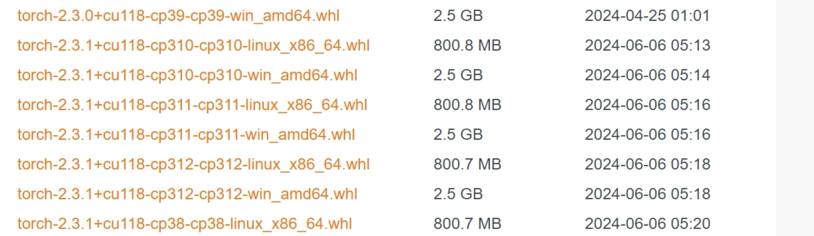
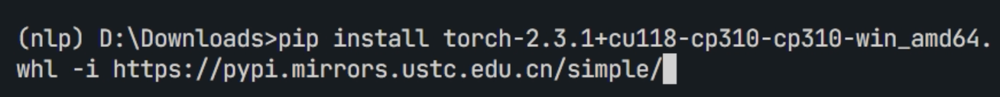
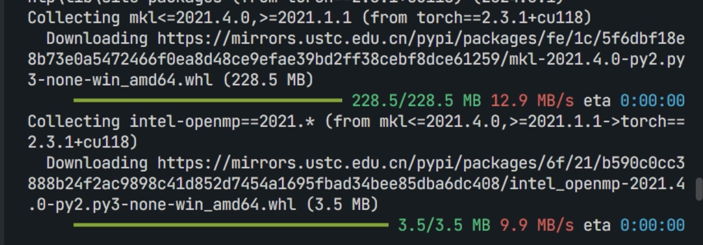
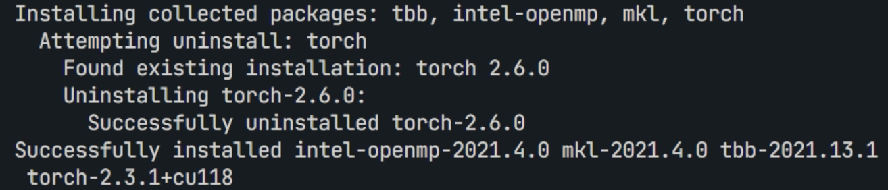

> - **注意！**在使用以下方法之前，请先安装好anaconda，并在环境变量中配置好环境变量（windows）。
> - 知晓`conda create -n`和`conda activate`命令的用法。
> - 未掌握者请前往CSDN自行学习相关知识后再阅读此文。
> - 在使用`conda`时，建议使用Anaconda Prompt，而不是cmd。

在国内安装cuda版本的torch是一个令人头痛的问题，pip安装使用镜像源加速的方法也不尽人意。
在此，参考各种方法后认为使用**whl文件**安装的方法最快。


点击[网址](https://mirrors.aliyun.com/pytorch-wheels/cu118/)，我这里下载的**cu118**版本的，如果你需要其他的cuda版本，请回到上级目录选择cuda版本。

> - **注意！**如何知晓自己的cuda版本？如果您的显卡为集显或非NVIDIA显卡，您不能安装cuda版本，请安装cpu版本。
> - 查看自己的cuda版本的命令：`nvidia-smi`
> - 如果cuda版本 >= 11.8, 您可以选择cu118版本（cuda是向下兼容的）。否则，请安装更低版本。

我的环境是如下：
```plaintext
操作系统：windows10
虚拟环境：anaconda
python版本：python3.10
cuda版本：12.7
```
 所以我选择了`torch-2.3.1+cu118-cp310-cp310-win_amd64.whl`文件。
 > - **注意！**cu118代表cuda11.8版本，cp310代表python3.10版本，win代表windows平台。请根据自己实际情况选择适合自己的whl文件。
 > - 如何查看自己的python版本？在cmd中输入`python --version`或`python -V`即可。

点击后会在浏览器下载，如果你的速度是KB级的，那说明这个方法不适用你。**MB级**是比较令人满意的速度。
下载后，使用**pip**安装。先到**文件下载的目录**下，激活你的环境，然后安装whl文件:
> 注意！请一定要在文件下载的目录下安装，或者使用文件的相对地址或绝对地址安装。


```bash
pip install torch-2.3.1+cu118-cp310-cp310-win_amd64.whl -i https://pypi.mirrors.ustc.edu.cn/simple/
```
在安装torch时需要下载其依赖库，如`numpy`。亲测pip在安装依赖项时科大源最快。

看到最后successfully installed后，就说明我们安装成功了。


接下来测试一下：

返回`True`, 说明安装成功。

`torchvision`等其他包同理

### 参考网址
1. [python如何安装各种库——pip, whl 和 tar.gz 最全安装方法](https://blog.csdn.net/zcs_xueli/article/details/105737403)
2. [使用国内镜像解决torch-cuda太慢问题](https://zhuanlan.zhihu.com/p/18188000858)
3. https://mirrors.aliyun.com/pytorch-wheels/cu118/