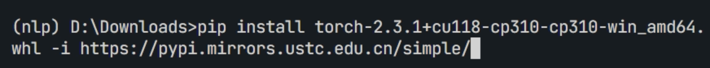
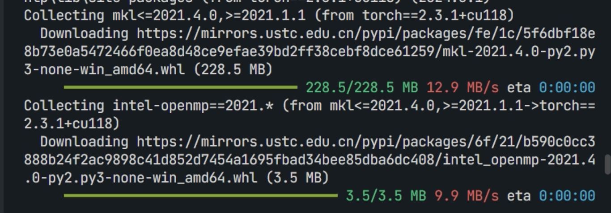
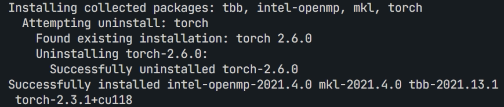
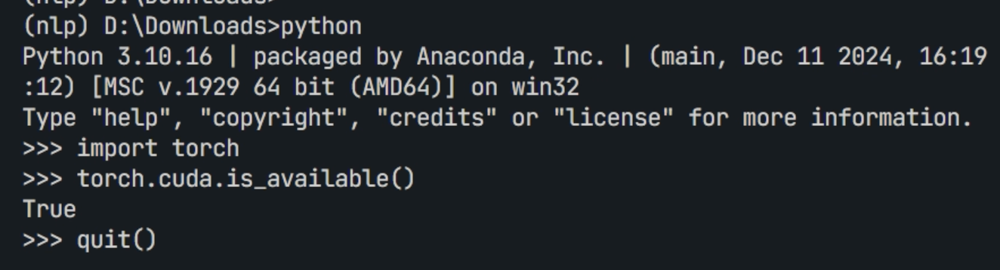

在国内安装cuda版本的torch是一个令人头痛的问题，pip安装使用镜像源加速的方法也不尽人意。
在此，参考各种方法后认为使用whl文件安装的方法最快。
点击[网址](https://mirrors.aliyun.com/pytorch-wheels/cu118/)，我这里下载的cu118版本的，如果你需要其他的cuda版本，请回到上级目录选择cuda版本。

我的环境是win10, python3.10, 所以我选择了torch-2.0.3.10, 所以我选择了`torch-2.3.1+cu118-cp310-cp310-win_amd64.whl`文件。
点击后会在浏览器下载，如果你的速度是KB级的，那说明这个方法不适用你。MB级是比较令人满意的速度。
下载后，使用pip安装。先到文件下载的目录下，激活你的环境，然后安装whl文件:


```bash
pip install torch-2.3.1+cu118-cp310-cp310-win_amd64.whl -i https://pypi.mirrors.ustc.edu.cn/simple/
```
亲测pip在安装依赖项时科大源最快。

看到最后successfully installed后，就说明我们安装成功了。



接下来测试一下：

返回`True`, 说明安装成功。

`torchvision`等其他包同理

### 参考网址
1. [python如何安装各种库——pip, whl 和 tar.gz 最全安装方法](https://blog.csdn.net/zcs_xueli/article/details/105737403)
2. [使用国内镜像解决torch-cuda太慢问题](https://zhuanlan.zhihu.com/p/18188000858)
3. https://mirrors.aliyun.com/pytorch-wheels/cu118/