## 1. 概述
### 1.1 大数据概述
- 并行计算 vs 分布式计算
    - 并行计算：计算密集型
        - 资源管理简单，共享内存访问和同步
    - 分布式计算：数据密集型
        - 需要考虑网络通信、数据传输和节点间协调

大数据处理系统的目标：拓展性、容错和高可用性、延迟考虑。


### 1.2 大数据处理概述
- 主要处理模式
    - 批处理/离线处理
        - 针对有界数据
        - 特点: 批量读入、集中处理
    - 流处理/实时处理
        - 针对无界数据
        - 特点: 来一个处理一个


- 常见大数据处理框架
    - 仅批处理：Hadoop
    - 仅流处理：Storm
    - 批流结合：Spark、Flink


- 窗口
    - 固定窗口
    - 滑动窗口
    - 会话窗口


- 一致性
    - 再流处理中，一致性可以分为4个级别：
        - at-most-once(最多一次)
        - at-least-once(至少一次)
        - exactly-once(精确一次)
        - end-to-end exactly-once(端到端精确一次)


        
```markdown
让我详细解释流处理中的四个一致性级别：

1. **At-most-once（最多一次）**：
   - 最基本的一致性级别
   - 消息可能会丢失，但绝j不会重复处理
   - 适用场景：对数据完整性要求不高的场景，如日志收集、监控数据等
   - 示例：实时网站访问统计，少量数据丢失可接受

2. **At-least-once（至少一次）**：
   - 确保消息至少被处理一次
   - 消息不会丢失，但可能会重复处理
   - 需要实现消息重传机制
   - 适用场景：对数据完整性要求高，但可以容忍重复的场景
   - 示例：支付通知，宁可重复通知也不能丢失

3. **Exactly-once（精确一次）**：
   - 确保消息只被处理一次
   - 需要实现消息去重和事务机制
   - 系统复杂度较高，性能开销大
   - 适用场景：对数据准确性要求极高的场景
   - 示例：银行转账处理

4. **End-to-end exactly-once（端到端精确一次）**：
   - 在整个处理流程中（从源到目的地）确保消息只被处理一次
   - 需要源系统和目标系统都支持事务
   - 最难实现，需要完善的错误处理机制
   - 适用场景：金融交易、计费系统等
   - 示例：跨行转账系统

这些一致性级别从上到下，实现难度逐渐增加，系统复杂度也随之提高。在实际应用中，需要根据业务需求和系统复杂度来选择合适的一致性级别。
```

#### 大数据处理系统发展历程
##### 1. MapReduce
- Google MapReduce解决了两个问题（可伸缩性和容错性）
    - 提供了一套简洁的数据处理API
    - 两个核心操作：Map和Reduce
        - Map: 对数据进行拆分和处理
        - Reduce: 对数据进行汇总和处理
[](https://zhuanlan.zhihu.com/p/82399103)

##### 2. Hadoop
- Hadoop是MapReduce的开源实现，对开源生态系统产生了巨大影响

##### 3. Storm
- 第一个真正被广泛采用的流式系统
- Storm能够产生低延迟但不精确（弱一致性）的结果
- 因此产生了Lambda架构

##### 4. Spark
- 是基于内存计算的大数据并行计算框架
- Spark Streaming是Spark的流式计算组件
- 争议
    - Spark Streaming不是真正的流式引擎（微批处理）
    - 现在使用Structured Streaming做流处理 

##### 5. MillWheel
- 通过将强一致性和精确一次处理与用于推断时间的工具（如水位和计时器）相结合，战胜了对乱序数据进行健壮处理的挑战，解决了事件时间和处理时间不一致的问题
    - 事件时间：事件发生的时间
    - 处理时间：事件被处理的时间


##### 6. Kafka
- 提供一个整洁的持久化模型，将批处理系统具有的诸如持久的、可重放的特性打包在流式处理的友好接口中
- 在生产者和消费者之间提供弹性隔离层

##### 7. Cloud DataFlow
- 统一的批流编程模型

##### 8. Flink
- 开源流处理的创新者
- 高效的快照实现方式，提供了正确性所需的强一致性保证

##### 9.Be


### 1.3 大数据处理架构概述
- 联机事务处理（OLTP）
    - 特点：日常事务处理，高并发、低延迟
    - 问题：当数据规模越来越庞大，性能下降
    - 解决办法：数据库重构，成本高，维护困难
    - 


- 联机分析处理
    - 特点：定期ETL，多维数据分析
    - 问题：规模受限，无法满足实时分析


- Lambda架构 
    - 适用场景‌：需同时满足实时性与历史数据分析的场景（如用户行为分析）
    - 缺点：维护成本高，数据一致性难保障
    - 


- Kappa架构（核心：Kafka）
    - 适用场景‌：实时性要求极高且数据规模持续增长的场景（如IoT设备监控）
    - 缺点：依赖历史数据流重放，长期存储与计算资源消耗大
    - 


- 流批一体架构
    - 将流式处理和批量处理的优势结合在一个统一的框架中进行数据处理
    - 有状态的计算
    - 

## 2. HDFS（Hadoop Distributed File System）
### 2.1 Hadoop简介
- 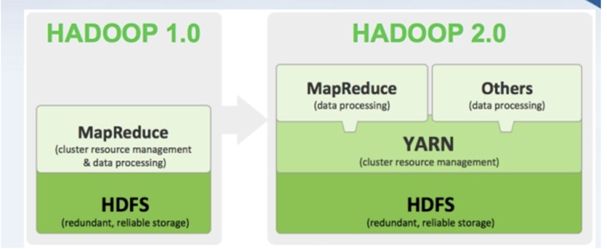

### 2.2 HDFS简介
#### 计算机集群
- 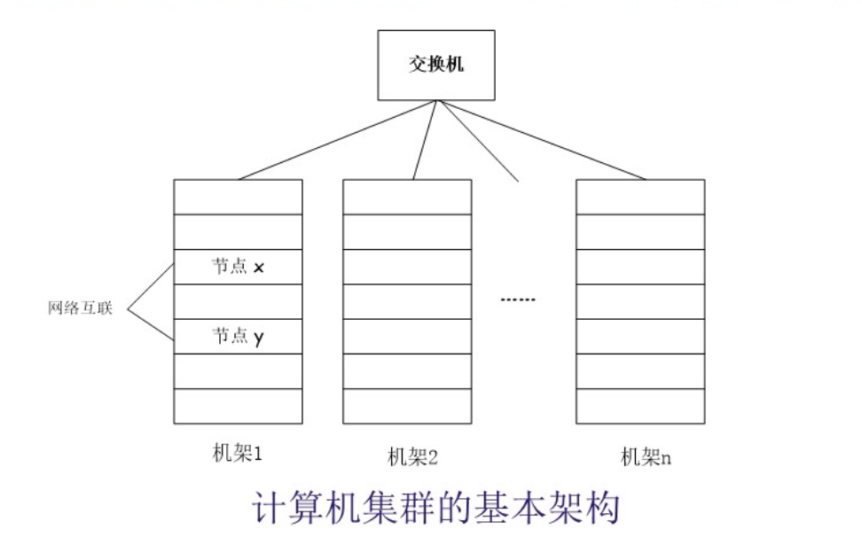

#### 分布式文件系统的设计需求
- 透明性
- 并发控制
- 文件复制
- 硬件和操作系统的异构性
- 可伸缩性
- 容错
- 安全
在具体实践中，不同产品实现的级别和方式都有不同。

#### HDFS设计目标
- 兼容廉价的
- 流数据读写
    - 流式方式访问文件系统数据：从头到底顺序读取
- 大数据集
    - 文件通常可以达到GB甚至TB级规模
- 简单的文件模型
    - 采用“一次写入，多次读取“的简单文件模型
- 移动计算比移动数据更便宜
- 强大的跨平台兼容性

#### 局限性
- 不适合低延迟数据访问
    - HDFS延迟高
- 无法存储大量小文件
    - 访问大量小文件严重影响性能 -> 合成大文件访问
- 不支持多用户写入及修改文件

#### HDFS相关概念
- 数据块
- NameNode
- Secondary NameNode
- DataNode

##### 数据块
- HDFS将大文件切分成块，这些块可以分布到不同节点上
- 默认的数据块大小为128MB

- 分块存储优势：
    - 支持大规模文件存储
        - 一个文件的大小不会受单节点的存储容量的限制，可以远远大于网络中任意节点的存储容量
    - 简化系统设计
    - 适合数据备份
        - 分布式系统最大要求就是容错
        - 每个文件块可以冗余存储在多个节点上，提高容错性和可用性

##### NameNode
- 负责管理分布式文件系统的命名空间及客户端对文件的访问
- 保存了两个重要文件，FsImage和EditLog
    - FsImage：用于维护文件系统树以及文件树中所有的文件和文件夹的元数据
    - EditLog：记录所有针对文件的创建、删除、重命名等操作
    - NameNode记录每个文件中的各个数据块所在的数据节点的位置信息，但是并不持久化这些信息

##### Secondary NameNode
- 辅助EditLog文件和FsImage文件的合并操作
- 作为NameNode的“检查点”；不能起到“热备份”作用


##### DataNode
- DataNode是分布式文件系统HDFS的工作节点
- 负责数据的存储和读取
- 根据客户端或是NameNode的调度来进行数据的存储和检索
- 并且向NameNode定期发送自己所存储的块的列表
- 数据会被保存在各自节点的本地Linux文件系统中

### 2.3 HDFS体系结构
- HDFS体系结构概述
    - HDFS采用”主从“架构
    - 一个HDFS集群包括一个NameNode和多个DataNode
    - NameNode是主节点
    - 一般一个集群中的DataNode运行一个DataNode进程
        - 每个DataNode周期性（默认3s）向NameNode发送”心跳“保持与NameNode的联系，心跳返回结果带有NameNode的指令
            - 没有按时发送“心跳”的DataNode会被标记为“死亡”（**默认连续10次没有收到DataNode的心跳，NameNode会主动主动发送一次检查**（默认5m，会重试1次）），NameNode不会再给它们发送任何I/O请求

- 命名空间管理
    - 注意从根目录开始操作

- 通信协议
- 客户端

- HDFS体系结构的局限性：HDFS只有一个NameNode
    - 命名空间限制
    - 性能的瓶颈
    - 隔离问题
    - 集群的可用性

- HDFS结合ZooKeeper自动故障转移架构
    - 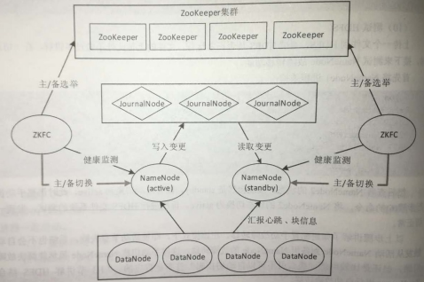
    - 解决了单点故障问题

### 2.4 HDFS存储原理
#### 冗余数据保存
- 为了保证系统的容错性和可用性，HDFS采用了多副本（默认3个副本）方式对数据进行冗余存储

#### 数据存储策略机架感知策略
- 数据存放
    - 第一个副本：放置在上传文件的DataNode；如果是集群外提交，则随机挑选出一台磁盘不太满、CPU不太忙的节点
        - 速度快，访问多
    - 第二个副本：放置在与第一个副本不同的机架的节点上
    - 第三个副本：与第一个副本相同机架的其他节点上
    - 更多副本：随机节点
        - 每个DataNode不存放超过一个副本
        - 每个机架的副本数量低于上限[$\dfrac{(副本数量-1)}{机架数量}+2$]
    - 
- 数据读取
    - HDFS提供了一个API可以确定一个DataNode所属的机架ID，客户端也可以调用API获取自己所属的机架ID；
    - 当客户端读取数据时，从NameNode获得数据块不同副本的存放位置列表，列表中包含了副本所在的DataNode，可以调用API来确定客户端和这些DataNode所属的机架ID，当发现某个数据块副本对应的机架ID和客户端对应的机架ID相同时，就优先选择该副本读取数据，如果没有发现，就随机选择一个副本读取数据
    - 省流：优先读同机架的副本读取数据
- 数据错误与恢复
    - 它把硬件出错看作是一种常态，而不是异常
    - 1.NameNode出错
        - 把核心文件（FsImage和EditLog）同步复制到备份服务器上。当NameNode出错时，就可以根据备份服务器中的FsImage和Editlog数据进行恢复。
        - 非热备份
    - 2.DataNode出错
        - 当DataNode发生故障，或者网络发生断网时，NameNode就无法收到来自一些DataNode的心跳信息，这时，这些DataNode就会被标记为“宕机”，节点上面的所有数据都会被标记为“不可读”，NameNode不会再给它们发送任何I/O请求
        - 有可能出现一种情形，即由于一些DataNode的不可用，会导一些数据块的副本数量小于冗余因子
        - NameNode会定期检查这种情况，一旦发现某个数据块的副本数量小于冗余因子，就会启动数据冗余复制，为它生成新的副本
        - HDFS和其它分布式文件系统的最大区别就是可以调整冗余数据的位置
    - 3.数据出错
        - 网络传输和磁盘错误等因素，都会造成数据错误
        - 客户端在读取到数据后，会采用md5和sha1对数据块进行校验，以确定读取到正确的数据
        - 在文件被创建时，客户端就会对每一个文件块进行信息摘录（Message Digest），并把这些信息写入到同一个路径的隐藏文件里面
        - 当客户端读取文件的时候，会先读取该信息文件，然后，利用该信息文件对每个读取的数据块进行校验，如果校验出错，客户端就会请求到另外一个DataNode读取该文件块，并且向NameNode报告这个文件块有错误，NameNode会定期检查并且重新复制这个块

### 2.5 HDFS数据读写
- 读文件
    - 客户端请求读文件，NameNode根据文件路径等信息判断请求是否合法，如果合法则向客户端返回文件中所有数据块的存放地址，对于第1个数据块，客户端从距离最近的存放该数据块的DataNode读取数据，当第1个数据块读取完毕后，客户端从距离最近的存放该数据块的DataNode读取数据，以此类推，客户端读取下一个数据块，直到读取完所有的数据块
    - 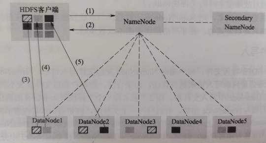

- 写文件
    - 流水线复制
        - 客户端请求写文件，NameNode根据相应策略决定存放文件块的DataNode，并将DataNode的位置告知客户端
        - 客户端与第1个DataNode建立连接，第1个DataNode与第2个DataNode建立连接，第2个DataNode与第3个DataNode建立连接，依次类推。客户端将文件块以流水线的方式写入这些DataNode
        - 第3个DataNode写入完毕后向第2个DataNode发送确认消息，第2个DataNode随后向第1个发送确认消息。最后第1个DataNode向客户端发送确认消息，表明该文件块写入成功。
        - 

## 3. 批处理框架MapReduce
### 3.1 概述
- Map、Reduce可以多个同时并行
- MapReduce采用“分治策略”
- Map、Reduce输入都是<key, value>，按照一定的映射规则将其转换为另一个或一批<key, value>输出
- 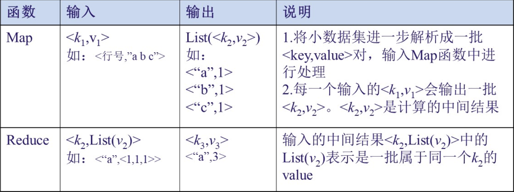
- WordCount实例
    - 统计大量文本中的每个单词出现的次数
    - 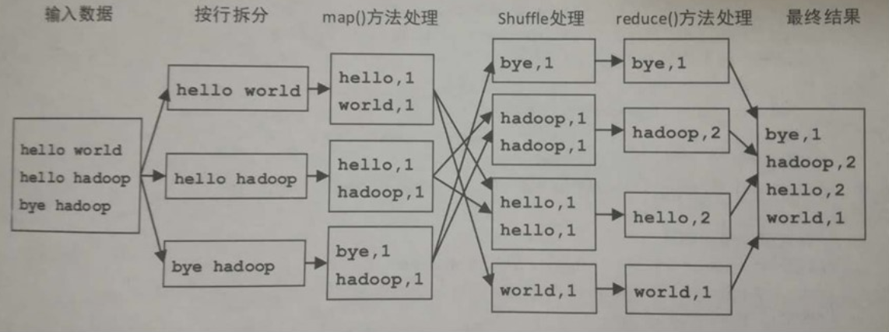

### 3.2 传统MapReduce架构
- 采用“Master/Slave”架构
    - JobTracer：主节点运行的后台进程，负责整个集群的**资源管理**和**作业管理**
        - 资源管理：通过监控TaskTracer管理集群拥有的计算资源
        - 作业管理：将作业Job分解为任务Task，并且进行任务调度以及跟踪任务的运行进度、资源使用情况
    - TaskTracer：从节点运行的后台进程，负责管理本节点的资源、执行JobReducer命令并汇报情况
- 在实际使用中，通常将MapReduce的输入和输出数据均存放在HDFS中
- 容错机制
    - JobTracer进程故障
        - 单点故障，属于MapReduce架构设计的缺陷
- 传统架构的缺点
    - 资源管理和作业紧密耦合
        - JobTracer既负责作业管理和资源调度，又负责管理集群的资源。
    - 作业的控制高度集中

### 3.3 资源管理器Yarn
#### 概述
- **Yarn**将资源管理功能独立出来
    - 一个纯粹的资源管理调度框架
    - 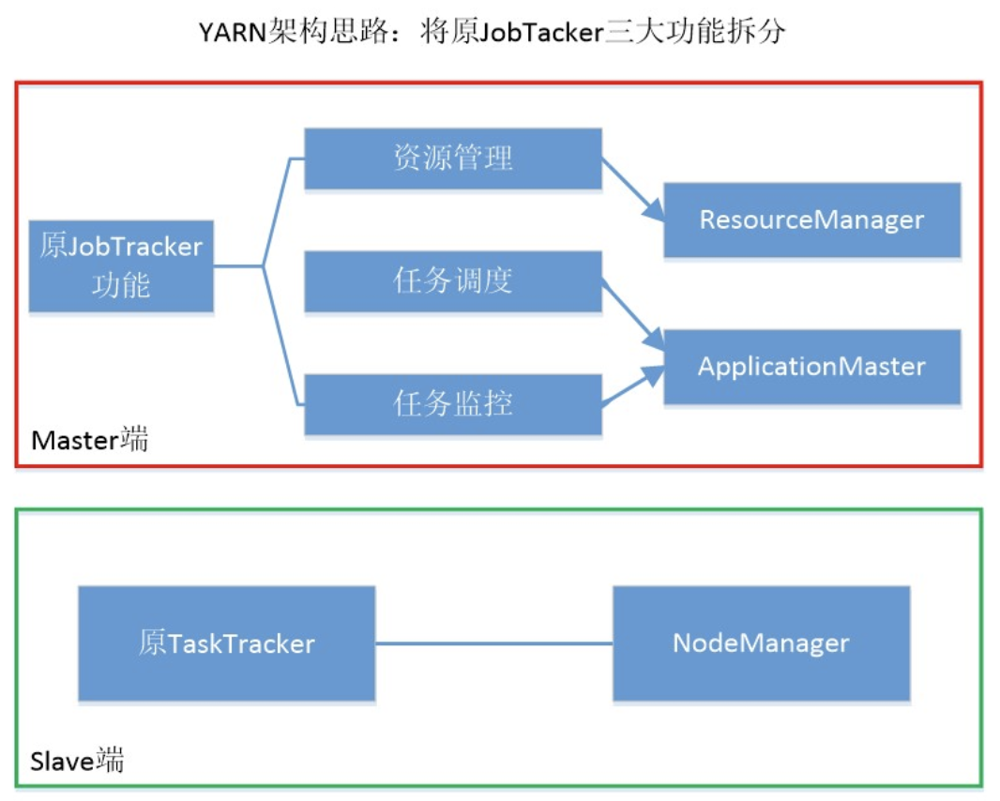

- 采用“Master/Slave”架构
- 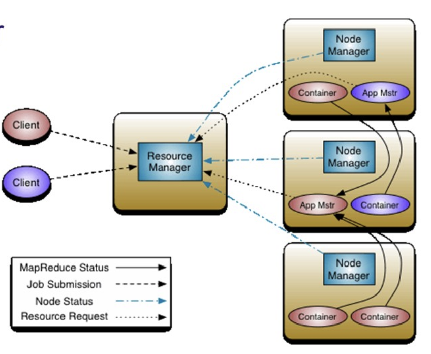

#### 体系结构
- ResourceManager
    - 在主节点运行，负责整个集群的资源管理和分配，主要由调度器和应用管理器两个组件构成
- NodeManager
    - 在从节点运行，负责节点的资源管理和任务管理
    - 定期向ResouceManager汇报本节点的资源使用情况和Container运行情况
    - 接受并处理来自ApplicationMaster
- ApplicationMaster
    - 通过与ResourceManager调度器协商获取资源（以Container表示）
- Container
    - 资源的抽象表示，包括CPU、内存等，是一个动态资源划分单位

- 应用启动流程
- 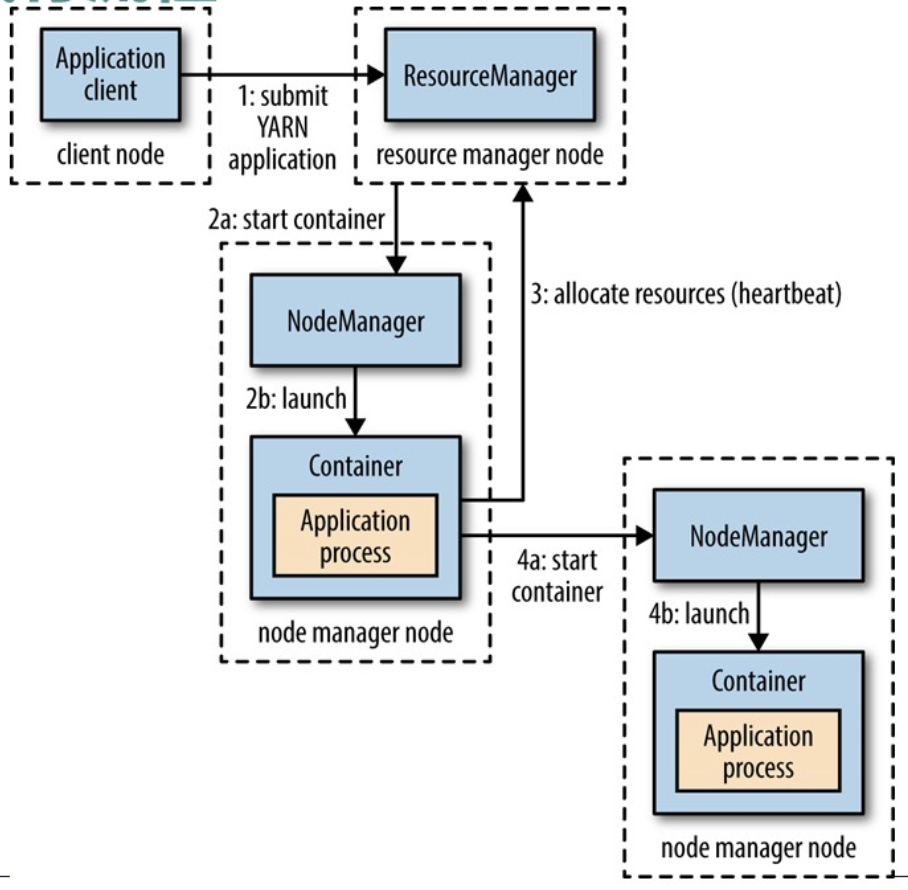

- 容错机制
    - ResourceManager故障
    - ApplicationMaster以及Container故障
        - 由于任务与具体框架有关，Yarn只会帮助其重新启动

#### 工作原理
- 单平台多框架
- 平台资源分配
    - ResourceManager

- 常用调度器
    - FIFO调度器
        - 优点：实现简单
        - 缺点：等待时间长
    - Capacity调度器
        - 维护层级式的队列
        - 队列内部FIFO
        - 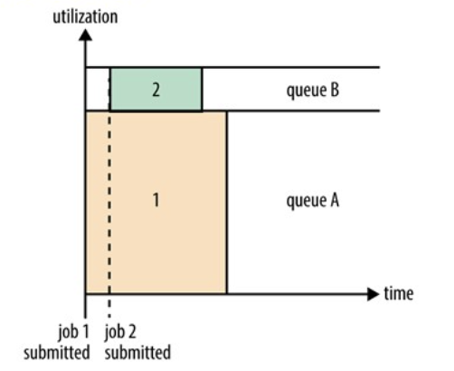
    - Fair调度器
        - 维护层级式队列（共享队列）
        - 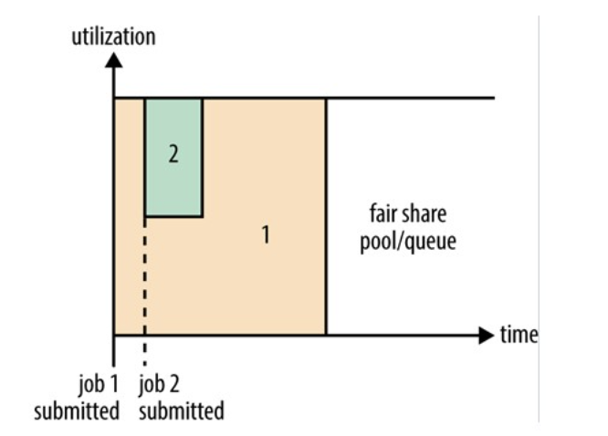

### 3.4 MapReduce工作原理
- MapReduce工作过程可分为3个阶段：Map、Shuffle、Reduce

#### 数据输入
- MapReduce框架定义了输入格式(InputFormat)
    - 输入格式将数据在逻辑上划分若干分片（split）
    - 分片的数量往往决定了Map任务的数量
- 常用InputFormat
    - TextInputFormat <行在整个文件中的字节偏移量:`LongWritable`，行的数据内容:`Text`>
        - 是默认的InputFormat

#### Map阶段
- 将输入的多个Split由Map任务以完全并行的方式处理
- 每个Map任务对输入分片的记录按照一定的规则解析成<key, value>

#### Shuffle阶段
- Shuffle是指Map阶段数据输出到Reduce阶段数据输入这一整个中间过程
- Shuffle过程是MapReduce工作流程的核心环节
- Shuffle过程分为
    - Map端的Shuffle
    - Reduce端的Shuffle
- 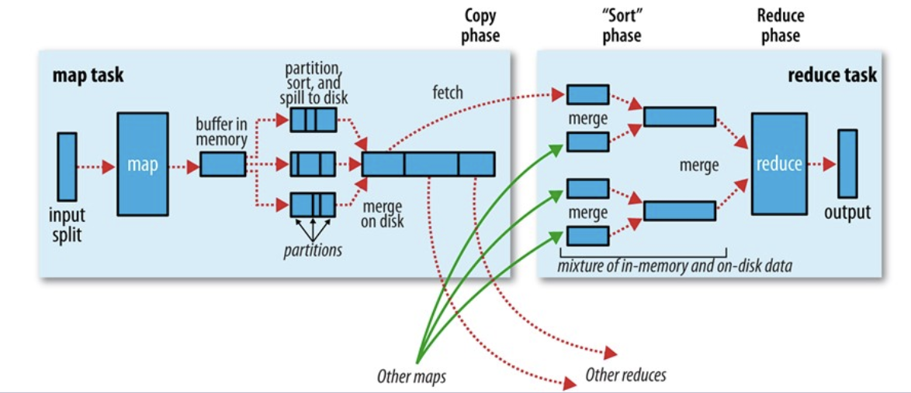

##### Map端的Shuffle
- 写入缓存
- 溢写
- 文件归并

###### （1）写入缓存
- 每个Map任务都被分配一个缓存（默认100MB）
- Map任务的输出结果首先写入缓存
- 在写入缓存前，key和value都被**序列化成字节数组**

###### （2）溢写（分区、排序、合并）
- 当缓存空间达到溢写比例（譬如0.8）时，就会启动溢写(spill)操作
- **分区(Partition)**
    - 总的分区数量等于Reduce任务的数量
    - 分区规则：取<key, value>中对key的hashCode值，然后对Reduce任务数量求余数，余数为分区编号，分区编号相一致的<key, value>则属于同一分区
    - ```(key.hashCode() & Integer.MAX_VALUE) % numReduceTasks ```
- **排序(Sort)**
    - 对每个分区内的键值对，根据key对他们进行内存排序
- **合并(Combine)**
    - 合并是一个可选操作
    - 将相同key的<key, value>的value累加起来

###### 文件归并(Merge)
- 归并是指将那些相同key的键值对合并成一个新的键值对
- Map任务最终输出一个大文件存储在节点的本地磁盘中

##### Reduce端的Shuffle
- 领取数据
- 归并数据

###### 领取数据
- Map任务完成后会通知ApplicationMaster，然后ApplicationMaster通知相关的Reduce任务进行数据的拉取
- Reduce任务收到通知后，会到该Map任务所在节点把属于自己分区的数据领取到本地

###### 归并数据
- Reduce任务领取的数据先放入缓存，并对来自Map任务的数据先归并、再合并，然后溢写到磁盘，在磁盘生成一个溢写文件。

##### Reduce阶段
- 将归并后得到的若干大文件直接输入Reduce任务

#### 数据输出
- 输出格式（`OutoutFormat`）

## 4. NoSQL数据库
### 4.2 NoSQL三大基石
- CAP
- BASE
- 最终一致性

#### CAP
- 一致性（Consistency）
- 可用性（Availability）
- 分区容忍性（Tolerance of Network Partition）
    - 系统中的一部分节点无法与其他节点通信，分离的系统也能正常运行。
- CAP理论告诉我们，一个分布式系统不可能同时满足一致性、可用性和分区容忍性这三个特性，最多只能同时满足其中两项。

#### BASE
- 基本可用（Basically Available）
    - 是指一个分布式系统的一部分发生问题变得不可用时，其他部分仍然可以正常使用
- 软状态（Soft State）
    - “软状态”是指状态可以有一段时间不同步，具有一定的滞后性
- 最终一致性（Eventually Consistent）
    - 一致性的类型包括强一致性和弱一致性，二者主要区别在高并发的数据访问操作下，后续能否获取最新的数据。
    - 最终一致性是弱一致性的一种特例，允许后续的访问操作可以暂时读不到更新后的数据，但经过一段时间之后，最终可以读取到更新后的数据。
> ACID是传统关系型数据库的事务处理特性，包括原子性（Atomicity）、一致性（Consistency）、隔离性（Isolation）、持久性（Durability），强调强一致性和事务的完整性。而BASE理论是为了适应分布式、高并发等场景而提出的，与ACID理论的设计理念不同，它不是ACID的扩展

### 4.3 HBase概述
- 高可靠、高性能、可伸缩的分布式数据库
- HBase是一个**稀疏、多维、排序**的**映射表**

#### 数据模型相关概念
- 表
- 行键
- 列族
- 列限定符
- 单元格
- 时间戳 

- HBase是列式数据库

### 4.4 HBase工作原理
#### 概述
- Master服务器
    - 负责管理和维护HBase表的分区信息
    - 维护Region服务器列表
    - 负载均衡
- Region服务器
    - Region服务器是HBase中最核心的模块，负责维护分配给自己的Region，并响应用户的读写请求
- 客户端
    - 获取Region的存储位置后，直接从Region服务器上读取数据
    - 客户端并不依赖Master，而是通过ZooKeeper来获取Region的位置信息

- 表和Region
    - 一个HBase中存储了很多表
    - 每个Hbase表中的行，根据行键的值对表中的行进行分区，每个行区间构成一个分区，被称为Region
    - 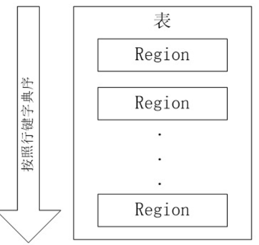
    - 初始时，每个表只有一个Region
    - 随着数据的不断插入，当一个Region包含的行数量达到一定阈值，就会自动等分为两个新的Region

#### Region定位
- Hbase使用三层结构来保存Region位置信息
- 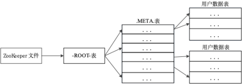
- 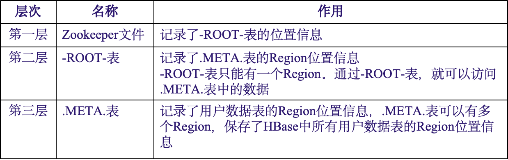
- 客户端访问数据时的“三级寻址”过程
    - 访问ZooKeeper，获取-ROOT-表的位置信息
    - 访问-ROOT-表，获取.META.表的位置信息
    - 访问.META.表，找出所需Region具体位于哪个Region服务器
    - 最后到Region服务器读取数据
- 寻址过程客户端只需要询问Zookeeper服务器，不需要连接Master服务器

#### HBase系统架构
- Region服务器
    - Region服务器是HBase中最核心的模块，负责维护分配给自己的Region，并响应用户的读写请求
    - **Region的存储**
    - Region服务器内部管理着一系列Region对象和一个HLog文件
        - 每个Region对象由多个Store组成
            - 每个Store对应表中的一个列族
            - 每个Store又包含一个MemStore（放在内存当中）和若干StoreFile（文件）
                - StoreFile通过HDFS的HFile实现， HFile的数据块通常采用压缩方式存储，可以大大减少网络I/O和磁盘I/O
        - HLog是磁盘上的记录文件，记录着所有的更新操作

- Region服务器工作原理
    - 写数据
        - 用户写入数据时，被分配到相应Region服务器去执行
        - 数据被分别写到HLog和MemStore
    - 读数据 
        - 当用户读取数据时，Region服务器会首先访问MemStore缓存
        - 如果找不到，再去磁盘上面的StoreFile中寻找

## 5. 分布式消息系统Kafka
- 传统架构问题
    - 系统耦合度高
    - 数据洪流难以应对
    - 重复消费
    - 容错性差
- Kafka
    - 异步解耦：订单服务将订单事件写入Kafka，库存、物流、通知服务并行消费
    - 高吞吐量
    - 数据的持久化与重放
    - 容错与冗余
### 5.1 什么是Kafka
#### 基本概念
- 服务器节点（Broker）:每一个Kafka程序实例即为一个Broker。
- 主题（Topic）：Kafka中的消息以主题为单位进行归类，生产者将消息发送到特定主题，消费者从特定主题进行消费
- 分区（Partition）：每个主题可以分为多个分区，一个分区只属于单个主题，分区均匀分布在集群中。分区是Kafka高吞吐、容灾、负载均衡的保障。
- 生产者（Producer）：消息发送方
- 消费者（Consumer）：消息接收方

### 5.2 Kafka工作原理
#### Kafka架构
- 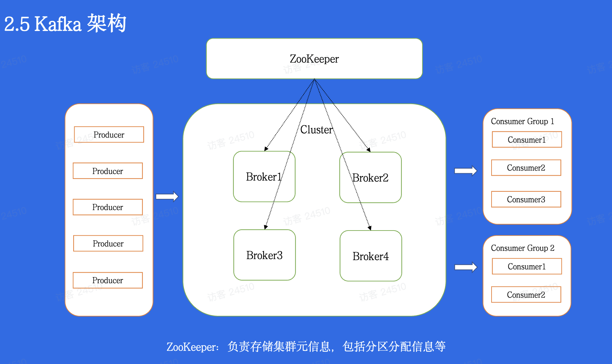
- Producer Group
    - Web前端产生的页面、服务器日志等
- Consumer Group
    - Hadpp集群、实时监控程序、数据仓库或其他服务
- Broker Group
- ZooKeeper Cluster
    - 管理和协调Broker


- 生产者（Producer）使用Push模式
    - 主动将消息推送到Broker
    - 优点：实时性好，延迟低
    - 适合生产者持续产生消息的场景

- 消费者（Consumer）使用Pull模式
    - 主动从Broker拉取消息进行消费
    - 优点：
        - 避免Consumer消息堆积
        - 可以设置offset从任何位置开始消费
        - Consumer可以根据自身处理能力控制消费速率
    - 缺点：
        - 如果没有消息时，需要轮询等待，会增加延迟
        - 需要维护消费位移（offset）

#### 主题和分区
- Broker将消息按主题和分区组织存储
- 每个分区是一个有序的、不可变的消息序列
- 消息通过位移（offset）来标识顺序

- Kafka为每个主题维护一个分区日志，记录各个分区消息存放情况
- 消息写入特点：
    - 消息以**追加**的方式写入到每个分区的尾部
    - 消息以**先入先出**（FIFO）的顺序进行读取
    - Kafka可以保证**单个分区**内消息的顺序，但无法在整个主题范围内保证消息的顺序

- 分区
    - 分区中每条记录都被分配了一个偏移量（offset）
        - 偏移量是一个连续递增的整数，唯一标识该记录在分区中的位置
- 消息保留策略
    - 两种策略：
        - 根据时间保留
        - 根据消息大小保留（用的少）
    - 每个Topic可以配置自己的保留策略
- 分区副本
    - 为提高数据的可靠性，同一分区可以复制多个副本分配到不同的Broker上
    - 副本分为：领导者副本和追随者副本
    - 领导者副本
        - 只有一个
        - 所有生产者和消费者都向领导者副本发送请求
    - 追随者副本
        - 追随者副本唯一的任务是从领导者副本复制消息，保持与领导者副本数据和状态的一致
    - 当领导者副本发生崩溃时，会从追随者副本中选出一个新的领导者副本
    - 副本消息复制机制
        - 跟随者为了与领导者同步，会周期性向领导者发起获取数据的请求（Pull） # 类似消费者
        - 请求消息包含了跟随者想要获取消息的偏移量，偏移量随着每次请求进行递增
        - 领导者从跟随者请求的偏移量可以知道消息复制的进度
    - 基于ISR动态复制方案
        - 领导者会动态维护一个需要与其保持同步的副本列表（包括领导者自己），该列表称为ISR。
        - 如果在一定时间内跟随者没有向领导者请求新的消息，该跟随者将被认为不同步，领导者会从ISR中将其移除（防止拖慢整体速度）。
        - 当跟随者重新与领导者保持同步时，领导者会将其再次加入到ISR中。
        - 当领导者失效时，也不会选择ISR中不存在的跟随者作为新的领导者。
        - ISR的列表数据保存在ZooKeeper中，每次ISR改变后，领导者都会将最新的ISR同步到ZooKeeper中。
        - 写入消息时，只有当ISR中所有跟随者都复制完毕，领导者才会将信息写入状态置为Commit（写入成功），而只有状态置为Commit的消息才能被消费者读取。
                - 从消费者角度看，要想成功读取消息，ISR中的所有副本必须处于同步状态，从而提高了数据的一致性。
                - 可以通过设置参数(min.insync.replicas)指定ISR的最小数量，默认值为1。
                    - 适当增加min.insync.replicas数量，可以提高系统的可用性。
    - 生产者通过ZooKeeper向领导者副本所在的Broker发送消息，领导者收到消息后需要向生产者返回消息确认收到的通知。
        - 可以对acks参数进行配置，指定写消息写入成功的界定：
            - acks=1（默认值）：只要领导者副本写入成功。
            - acks=all：需要ISR中的所有副本写入成功。
            - acks=0：消息发送后即认为成功（不等待Broker的响应）。
        - Broker会通过acks来判断何时向生产者返回响应。

#### 5.2.4 消费者组

##### 消费者组模式
- 同一消费者组内不允许多个消费者消费同一分区的消息，不同的消费者组可以同时消费同一分区的消息。
    - 分区与同一消费者组中的消费者是多对一的关系，而不是一对多的关系。
- 每条消息发送到主题后，只能发送给某个消费者组中的唯一一个消费者实例。
- 能够同时具备队列和发布订阅两种模式的特点：
    - 如果所有消费者实例属于同一分组，则该过程就是传统的队列模式。
    - 如果所有的消费者都不属于同一分组，则该过程就是发布订阅模式。

#### 5.2.5 数据存储机制

- Kafka的消息由主题进行分类，而主题在物理上又分为多个分区。
    - 在Kafka数据存储中，每个分区的消息数据存储于一个独立的文件夹中，分文件夹的命名规则为“主题名-分区编号”，分区编号从0开始，依次递增。
    - 一个分区在物理上又由多个段（segment）组成。
        - segment是Kafka数据存储的最小单位。
    - 每个分区的消息数据会被分配到多个segment文件中。
#### segment文件

- 由两部分组成：
    - 索引文件（后缀为.index）
        - 存储元数据，采用稀疏索引记录对应数据文件中消息的物理偏移地址。
    - 数据文件（后缀为.log）
        - 存储实际消息。
- 索引文件和数据文件一一对应，且成对出现。
- 命名由20位数字组成（编号长度不够以0补充）。
    - 同一分区中的第一个segment文件的文件编号从0开始，下一个segment文件的编号为上一个segment文件最后一条消息的offset值。
#### Kafka查找消息（消费者通过offset查找）

- 通过offset值定位到索引文件。
- 通过索引文件查询消息物理偏移地址。
- 通过物理偏移地址定位消息内容。

## 6. 流处理系统Storm（不需要掌握的很好）
