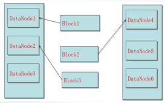
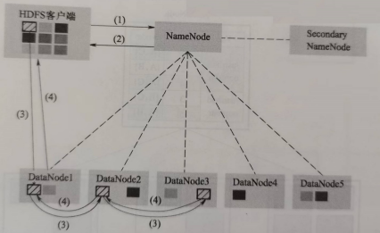

## 1. 概述
### 1.1 大数据概述
- 并行计算 vs 分布式计算
    - 并行计算：计算密集型
        - 资源管理简单，共享内存访问和同步
    - 分布式计算：数据密集型
        - 需要考虑网络通信、数据传输和节点间协调

大数据处理系统的目标：拓展性、容错和高可用性、延迟考虑。


### 1.2 大数据处理概述
- 主要处理模式
    - 批处理/离线处理
        - 针对有界数据
        - 特点: 批量读入、集中处理
    - 流处理/实时处理
        - 针对无界数据
        - 特点: 来一个处理一个


- 常见大数据处理框架
    - 仅批处理：Hadoop
    - 仅流处理：Storm
    - 批流结合：Spark、Flink


- 窗口
    - 固定窗口
    - 滑动窗口
    - 会话窗口


- 一致性
    - 再流处理中，一致性可以分为4个级别：
        - at-most-once(最多一次)
        - at-least-once(至少一次)
        - exactly-once(精确一次)
        - end-to-end exactly-once(端到端精确一次)


        
```markdown
让我详细解释流处理中的四个一致性级别：

1. **At-most-once（最多一次）**：
   - 最基本的一致性级别
   - 消息可能会丢失，但绝j不会重复处理
   - 适用场景：对数据完整性要求不高的场景，如日志收集、监控数据等
   - 示例：实时网站访问统计，少量数据丢失可接受

2. **At-least-once（至少一次）**：
   - 确保消息至少被处理一次
   - 消息不会丢失，但可能会重复处理
   - 需要实现消息重传机制
   - 适用场景：对数据完整性要求高，但可以容忍重复的场景
   - 示例：支付通知，宁可重复通知也不能丢失

3. **Exactly-once（精确一次）**：
   - 确保消息只被处理一次
   - 需要实现消息去重和事务机制
   - 系统复杂度较高，性能开销大
   - 适用场景：对数据准确性要求极高的场景
   - 示例：银行转账处理

4. **End-to-end exactly-once（端到端精确一次）**：
   - 在整个处理流程中（从源到目的地）确保消息只被处理一次
   - 需要源系统和目标系统都支持事务
   - 最难实现，需要完善的错误处理机制
   - 适用场景：金融交易、计费系统等
   - 示例：跨行转账系统

这些一致性级别从上到下，实现难度逐渐增加，系统复杂度也随之提高。在实际应用中，需要根据业务需求和系统复杂度来选择合适的一致性级别。
```

#### 大数据处理系统发展历程
##### 1. MapReduce
- Google MapReduce解决了两个问题（可伸缩性和容错性）
    - 提供了一套简洁的数据处理API
    - 两个核心操作：Map和Reduce
        - Map: 对数据进行拆分和处理
        - Reduce: 对数据进行汇总和处理
[](https://zhuanlan.zhihu.com/p/82399103)

##### 2. Hadoop
- Hadoop是MapReduce的开源实现，对开源生态系统产生了巨大影响

##### 3. Storm
- 第一个真正被广泛采用的流式系统
- Storm能够产生低延迟但不精确（弱一致性）的结果
- 因此产生了Lambda架构

##### 4. Spark
- 是基于内存计算的大数据并行计算框架
- Spark Streaming是Spark的流式计算组件
- 争议
    - Spark Streaming不是真正的流式引擎（微批处理）
    - 现在使用Structured Streaming做流处理 

##### 5. MillWheel
- 通过将强一致性和精确一次处理与用于推断时间的工具（如水位和计时器）相结合，战胜了对乱序数据进行健壮处理的挑战，解决了事件时间和处理时间不一致的问题
    - 事件时间：事件发生的时间
    - 处理时间：事件被处理的时间


##### 6. Kafka
- 提供一个整洁的持久化模型，将批处理系统具有的诸如持久的、可重放的特性打包在流式处理的友好接口中
- 在生产者和消费者之间提供弹性隔离层

##### 7. Cloud DataFlow
- 统一的批流编程模型

##### 8. Flink
- 开源流处理的创新者
- 高效的快照实现方式，提供了正确性所需的强一致性保证

##### 9.Be


### 1.3 大数据处理架构概述
- 联机事务处理（OLTP）
    - 特点：日常事务处理，高并发、低延迟
    - 问题：当数据规模越来越庞大，性能下降
    - 解决办法：数据库重构，成本高，维护困难
    - 


- 联机分析处理
    - 特点：定期ETL，多维数据分析
    - 问题：规模受限，无法满足实时分析


- Lambda架构 
    - 适用场景‌：需同时满足实时性与历史数据分析的场景（如用户行为分析）
    - 缺点：维护成本高，数据一致性难保障
    - 


- Kappa架构（核心：Kafka）
    - 适用场景‌：实时性要求极高且数据规模持续增长的场景（如IoT设备监控）
    - 缺点：依赖历史数据流重放，长期存储与计算资源消耗大
    - 


- 流批一体架构
    - 将流式处理和批量处理的优势结合在一个统一的框架中进行数据处理
    - 有状态的计算
    - 

## 2. HDFS（Hadoop Distributed File System）
### 2.1 Hadoop简介
- 

### 2.2 HDFS简介
#### 计算机集群
- 

#### 分布式文件系统的设计需求
- 透明性
- 并发控制
- 文件复制
- 硬件和操作系统的异构性
- 可伸缩性
- 容错
- 安全
在具体实践中，不同产品实现的级别和方式都有不同。

#### HDFS设计目标
- 兼容廉价的
- 流数据读写
    - 流式方式访问文件系统数据：从头到底顺序读取
- 大数据集
    - 文件通常可以达到GB甚至TB级规模
- 简单的文件模型
    - 采用“一次写入，多次读取“的简单文件模型
- 移动计算比移动数据更便宜
- 强大的跨平台兼容性

#### 局限性
- 不适合低延迟数据访问
    - HDFS延迟高
- 无法存储大量小文件
    - 访问大量小文件严重影响性能 -> 合成大文件访问
- 不支持多用户写入及修改文件

#### HDFS相关概念
- 数据块
- NameNode
- Secondary NameNode
- DataNode

##### 数据块
- HDFS将大文件切分成块，这些块可以分布到不同节点上
- 默认的数据块大小为128MB

- 分块存储优势：
    - 支持大规模文件存储
        - 一个文件的大小不会受单节点的存储容量的限制，可以远远大于网络中任意节点的存储容量
    - 简化系统设计
    - 适合数据备份
        - 分布式系统最大要求就是容错
        - 每个文件块可以冗余存储在多个节点上，提高容错性和可用性

##### NameNode
- 负责管理分布式文件系统的命名空间及客户端对文件的访问
- 保存了两个重要文件，FsImage和EditLog
    - FsImage：用于维护文件系统树以及文件树中所有的文件和文件夹的元数据
    - EditLog：记录所有针对文件的创建、删除、重命名等操作
    - NameNode记录每个文件中的各个数据块所在的数据节点的位置信息，但是并不持久化这些信息

##### Secondary NameNode
- 辅助EditLog文件和FsImage文件的合并操作
- 作为NameNode的“检查点”；不能起到“热备份”作用


##### DataNode
- DataNode是分布式文件系统HDFS的工作节点
- 负责数据的存储和读取
- 根据客户端或是NameNode的调度来进行数据的存储和检索
- 并且向NameNode定期发送自己所存储的块的列表
- 数据会被保存在各自节点的本地Linux文件系统中

### 2.3 HDFS体系结构
- HDFS体系结构概述
    - HDFS采用”主从“架构
    - 一个HDFS集群包括一个NameNode和多个DataNode
    - NameNode是主节点
    - 一般一个集群中的DataNode运行一个DataNode进程
        - 每个DataNode周期性（默认3s）向NameNode发送”心跳“保持与NameNode的联系，心跳返回结果带有NameNode的指令
            - 没有按时发送“心跳”的DataNode会被标记为“死亡”（**默认连续10次没有收到DataNode的心跳，NameNode会主动主动发送一次检查**（默认5m，会重试1次）），NameNode不会再给它们发送任何I/O请求

- 命名空间管理
    - 注意从根目录开始操作

- 通信协议
- 客户端

- HDFS体系结构的局限性：HDFS只有一个NameNode
    - 命名空间限制
    - 性能的瓶颈
    - 隔离问题
    - 集群的可用性

- HDFS结合ZooKeeper自动故障转移架构
    - 
    - 解决了单点故障问题

### 2.4 HDFS存储原理
#### 冗余数据保存
- 为了保证系统的容错性和可用性，HDFS采用了多副本（默认3个副本）方式对数据进行冗余存储

#### 数据存储策略机架感知策略
- 数据存放
    - 第一个副本：放置在上传文件的DataNode；如果是集群外提交，则随机挑选一台磁盘不太满、CPU不太忙的节点
        - 速度快，访问多
    - 第二个副本：放置在与第一个副本不同的机架的节点上
    - 第三个副本：与第一个副本相同机架的其他节点上
    - 更多副本：随机节点
        - 每个DataNode不存放超过一个副本
        - 每个机架的副本数量低于上限[$\dfrac{(副本数量-1)}{机架数量}+2$]
    - 
- 数据读取
    - HDFS提供了一个API可以确定一个DataNode所属的机架ID，客户端也可以调用API获取自己所属的机架ID；
    - 当客户端读取数据时，从NameNode获得数据块不同副本的存放位置列表，列表中包含了副本所在的DataNode，可以调用API来确定客户端和这些DataNode所属的机架ID，当发现某个数据块副本对应的机架ID和客户端对应的机架ID相同时，就优先选择该副本读取数据，如果没有发现，就随机选择一个副本读取数据
    - 省流：优先读同机架的副本读取数据
- 数据错误与恢复
    - 它把硬件出错看作一种常态，而不是异常
    - 1.NameNode出错
        - 把核心文件（FsImage和EditLog）同步复制到备份服务器上。当NameNode出错时，就可以根据备份服务器中的FsImage和Editlog数据进行恢复。
        - 非热备份
    - 2.DataNode出错
        - 当DataNode发生故障，或者网络发生断网时，NameNode就无法收到来自一些DataNode的心跳信息，这时，这些DataNode就会被标记为“宕机”，节点上面的所有数据都会被标记为“不可读”，NameNode不会再给它们发送任何I/O请求
        - 有可能出现一种情形，即由于一些DataNode的不可用，会导一些数据块的副本数量小于冗余因子
        - NameNode会定期检查这种情况，一旦发现某个数据块的副本数量小于冗余因子，就会启动数据冗余复制，为它生成新的副本
        - HDFS和其它分布式文件系统的最大区别就是可以调整冗余数据的位置
    - 3.数据出错
        - 网络传输和磁盘错误等因素，都会造成数据错误
        - 客户端在读取到数据后，会采用md5和sha1对数据块进行校验，以确定读取到正确的数据
        - 在文件被创建时，客户端就会对每一个文件块进行信息摘录（Message Digest），并把这些信息写入到同一个路径的隐藏文件里面
        - 当客户端读取文件的时候，会先读取该信息文件，然后，利用该信息文件对每个读取的数据块进行校验，如果校验出错，客户端就会请求到另外一个DataNode读取该文件块，并且向NameNode报告这个文件块有错误，NameNode会定期检查并且重新复制这个块

### 2.5 HDFS数据读写
- 读文件
    - 客户端请求读文件，NameNode根据文件路径等信息判断请求是否合法，如果合法则向客户端返回文件中所有数据块的存放地址，对于第1个数据块，客户端从距离最近的存放该数据块的DataNode读取数据，当第1个数据块读取完毕后，客户端从距离最近的存放该数据块的DataNode读取数据，以此类推，客户端读取下一个数据块，直到读取完所有的数据块
    - 

- 写文件
    - 流水线复制
        - 客户端请求写文件，NameNode根据相应策略决定存放文件块的DataNode，并将DataNode的位置告知客户端
        - 客户端与第1个DataNode建立连接，第1个DataNode与第2个DataNode建立连接，第2个DataNode与第3个DataNode建立连接，依次类推。客户端将文件块以流水线的方式写入这些DataNode
        - 第3个DataNode写入完毕后向第2个DataNode发送确认消息，第2个DataNode随后向第1个发送确认消息。最后第1个DataNode向客户端发送确认消息，表明该文件块写入成功。
        - 

## 3. 批处理框架MapReduce
### 3.1 概述
- Map、Reduce可以多个同时并行
- MapReduce采用“分治策略”
- Map、Reduce输入都是<key, value>，按照一定的映射规则将其转换为另一个或一批<key, value>输出
- 
- WordCount实例
    - 统计大量文本中的每个单词出现的次数
    - 

### 3.2 传统MapReduce架构
- 采用“Master/Slave”架构
    - JobTracer：主节点运行的后台进程，负责整个集群的**资源管理**和**作业管理**
        - 资源管理：通过监控TaskTracer管理集群拥有的计算资源
        - 作业管理：将作业Job分解为任务Task，并且进行任务调度以及跟踪任务的运行进度、资源使用情况
    - TaskTracer：从节点运行的后台进程，负责管理本节点的资源、执行JobReducer命令并汇报情况
- 在实际使用中，通常将MapReduce的输入和输出数据均存放在HDFS中
- 容错机制
    - JobTracer进程故障
        - 单点故障，属于MapReduce架构设计的缺陷
- 传统架构的缺点
    - 资源管理和作业紧密耦合
        - JobTracer既负责作业管理和资源调度，又负责管理集群的资源。
    - 作业的控制高度集中

### 3.3 资源管理器Yarn
#### 概述
- **Yarn**将资源管理功能独立出来
    - 一个纯粹的资源管理调度框架
    - 

- 采用“Master/Slave”架构
- 

#### 体系结构
- ResourceManager：
- NodeManager
    - 定期向ResouceManager汇报本节点的资源使用情况和Container运行情况
    - 接受并处理来自ApplicationMaster
- ApplicationMaster
    - 通过与ResourceManager调度器协商获取资源（以Container表示）
- Container
    - 资源的抽象表示，包括CPU、内存等，是一个动态资源划分单位

- 应用启动流程
- 

- 容错机制
    - ResourceManager故障
    - ApplicationMaster以及Container故障
        - 由于任务与具体框架有关，Yarn只会帮助其重新启动

#### 工作原理
- 单平台多框架
- 平台资源分配
    - ResourceManager

- 常用调度器
    - FIFO调度器
        - 优点：实现简单
        - 缺点：等待时间长
    - Capacity调度器
        - 维护层级式的队列
        - 队列内部FIFO
        - 
    - Fair调度器
        - 维护层级式队列（共享队列）
        - 

### 3.4 MapReduce工作原理
- MapReduce工作过程可分为3个阶段：Map、Shuffle、Reduce

#### 数据输入
- MapReduce框架定义了输入格式(InputFormat)
    - 输入格式将数据在逻辑上划分若干分片（split）
    - 分片的数量往往决定了Map任务的数量
- 常用InputFormat
    - TextInputFormat <行在整个文件中的字节偏移量:`LongWritable`，行的数据内容:`Text`>
        - 是默认的InputFormat

#### Map阶段
- 将输入的多个Split由Map任务以完全并行的方式处理
- 每个Map任务对输入分片的记录按照一定的规则解析成<key, value>

#### Shuffle阶段
- Shuffle是指Map阶段数据输出到Reduce阶段数据输入这一整个中间过程
- Shuffle过程是MapReduce工作流程的核心环节
- Shuffle过程分为
    - Map端的Shuffle
    - Reduce端的Shuffle
- 

##### Map端的Suffle
- 写入缓存
- 溢写
- 文件归并

###### （1）写入缓存
- 每个Map任务都被分配一个缓存（默认100MB）
- Map任务的输出结果首先写入缓存
- 在写入缓存前，key和value都被**序列化成字节数组**

###### （2）溢写（分区、排序、合并）
- 当缓存空间达到溢写比例（譬如0.8）时，就会启动溢写(spill)操作
- **分区(Partition)**
    - 总的分区数量等于Reduce任务的数量
    - 分区规则：取<key, value>中对key的hashCode值，然后对Reduce任务数量求余数，余数为分区编号，分区编号相一致的<key, value>则属于同一分区
    - ```(key.hashCode() & Integer.MAX_VALUE) % numReduceTasks ```
- **排序(Sort)**
    - 对每个分区内的键值对，根据key对他们进行内存排序
- **合并(Combine)**
    - 合并是一个可选操作
    - 将相同key的<key, value>的value累加起来
- **文件归并(Merge)**
    - 归并是指将那些相同key的键值对合并成一个新的键值对
    - Map任务最终输出一个大文件存储在节点的本地磁盘中


#### Reduce阶段

#### 数据输出