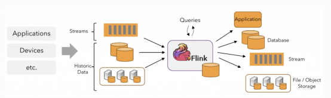

## 1. 概述
### 1.1 大数据概述
- 并行计算 vs 分布式计算
    - 并行计算：计算密集型
        - 资源管理简单，共享内存访问和同步
    - 分布式计算：数据密集型
        - 需要考虑网络通信、数据传输和节点间协调

大数据处理系统的目标：拓展性、容错和高可用性、延迟考虑。


### 1.2 大数据处理概述
- 主要处理模式
    - 批处理/离线处理
        - 针对有界数据
        - 特点: 批量读入、集中处理
    - 流处理/实时处理
        - 针对无界数据
        - 特点: 来一个处理一个


- 常见大数据处理框架
    - 仅批处理：Hadoop
    - 仅流处理：Storm
    - 批流结合：Spark、Flink


- 窗口
    - 固定窗口
    - 滑动窗口
    - 会话窗口


- 一致性
    - 再流处理中，一致性可以分为4个级别：
        - at-most-once(最多一次)
        - at-least-once(至少一次)
        - exactly-once(精确一次)
        - end-to-end exactly-once(端到端精确一次)
```markdown
让我详细解释流处理中的四个一致性级别：

1. **At-most-once（最多一次）**：
   - 最基本的一致性级别
   - 消息可能会丢失，但绝不会重复处理
   - 适用场景：对数据完整性要求不高的场景，如日志收集、监控数据等
   - 示例：实时网站访问统计，少量数据丢失可接受

2. **At-least-once（至少一次）**：
   - 确保消息至少被处理一次
   - 消息不会丢失，但可能会重复处理
   - 需要实现消息重传机制
   - 适用场景：对数据完整性要求高，但可以容忍重复的场景
   - 示例：支付通知，宁可重复通知也不能丢失

3. **Exactly-once（精确一次）**：
   - 确保消息只被处理一次
   - 需要实现消息去重和事务机制
   - 系统复杂度较高，性能开销大
   - 适用场景：对数据准确性要求极高的场景
   - 示例：银行转账处理

4. **End-to-end exactly-once（端到端精确一次）**：
   - 在整个处理流程中（从源到目的地）确保消息只被处理一次
   - 需要源系统和目标系统都支持事务
   - 最难实现，需要完善的错误处理机制
   - 适用场景：金融交易、计费系统等
   - 示例：跨行转账系统

这些一致性级别从上到下，实现难度逐渐增加，系统复杂度也随之提高。在实际应用中，需要根据业务需求和系统复杂度来选择合适的一致性级别。
```

#### 大数据处理系统发展历程
##### 1. MapReduce
- Google MapReduce解决了两个问题（可伸缩性和容错性）
    - 提供了一套简洁的数据处理API
    - 两个核心操作：Map和Reduce
        - Map: 对数据进行拆分和处理
        - Reduce: 对数据进行汇总和处理

##### 2. Hadoop
- Hadoop是MapReduce的开源实现，对来源生态系统产生了巨大影响

##### 3. Storm
- 第一个真正被广泛采用的流式系统
- Storm能够产生低延迟但不精确（弱一致性）的结果
- 因此产生了Lambda架构

##### 4. Spark
- 是基于内存计算的大数据并行计算框架
- Spark Streaming是Spark的流式计算组件
- 争议
    - Spark Streaming不是真正的流式引擎（微批处理）
    - 现在使用Structured Streaming做流处理 

##### 5. MillWheel
- 通过将强一致性和精确一次处理与用于推断时间的工具（如水位和计时器）相结合，战胜了对乱序数据进行健壮处理的挑战，解决了事件时间和处理时间不一致的问题
    - 事件时间：事件发生的时间
    - 处理时间：事件被处理的时间


##### 6. Kafka


##### 7. Flink


##### 8.Beam


### 1.3 大数据处理架构概述
- 联机事务处理（OLTP）
    - 特点：日常事务处理，高并发、低延迟
    - 问题：当数据规模越来越庞大，性能下降
    - 解决办法：数据库重构，成本高，维护困难
    - 


- 联机分析处理
    - 特点：定期ETL，多维数据分析
    - 问题：规模受限，无法满足实时分析


- Lambda架构 
    - 适用场景‌：需同时满足实时性与历史数据分析的场景（如用户行为分析）
    - 缺点：维护成本高，数据一致性难保障
    - 


- Kappa架构（核心：Kafka）
    - 适用场景‌：实时性要求极高且数据规模持续增长的场景（如IoT设备监控）
    - 缺点：依赖历史数据流重放，长期存储与计算资源消耗大
    - 


- 流批一体架构
    - 将流式处理和批量处理的优势结合在一个统一的框架中进行数据处理
    - 有状态的计算
    - 