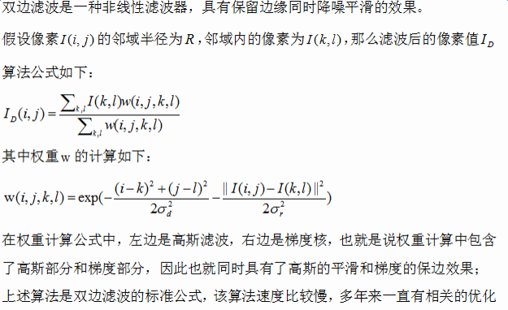
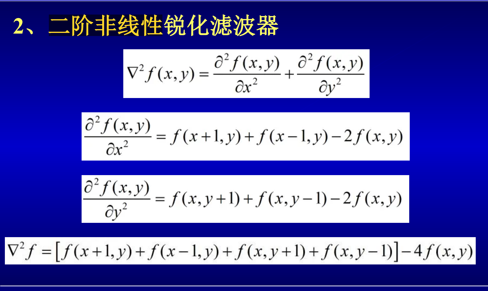
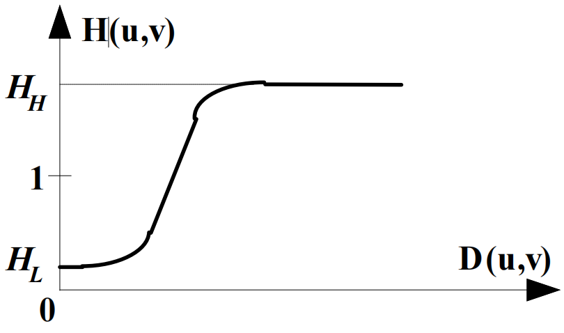

## 1
- 融合
- 配准
- 底片
    - middle format
    - full format
    - 半底片
#### 图像显示打印
- 半调输出
    - 利用人眼的集成特性，通过控制二值点的形式（数量尺寸形状）来获取视觉上不同的灰度感觉。
    - 是一种将灰度图像转化为二值图像的技术。
- 幅度调制（不行）
- 频率调制：缺点：点增益
- 控制数量实现：
    - 调制模版
        - 2x2 -> 5
        - 3x3 -> 10
        - 4x4(最常用)
- dpi:dot per inch(2.54cm)
- 彩色半调技术：
    - 每种rgb只有饱和色和黑色
    - 实际打印使用的是红绿蓝的补色

#### 视觉过程
- 锥细胞柱细胞
- 人眼是跳着看的
    - 人的注意力机制
        - 自顶向下
        - 自底向上

#### 空间分辨率和幅度分辨率
- 真彩色

## 2
- 像素的邻域
    - 4邻域$N_4$
    - 对角邻域$N_D$
    - 8邻域$N_8$
- 邻接和连接
    - 4连接：两个像素p,v在V中取值且r在$N_4(p)$中
    - 8连接：两个像素p,v在V中取值且r在$N_8(p)$中
    - 混合连接（m连接）：满足一项情况之一：
        - 在$N_4(p)$中
        - 在$N_8(p)$中，且$N_4(p)\cup N_4(r)$是空集

- 图像坐标变换
    - 平移
    - 旋转
    - 缩放

- 插值
    - 前向映射
    - 后向映射
        - 放大后图像整数坐标点映射到原始图像
        - 零阶插值（会产生伪边界）
        - 双线性插值
        - 双三次插值

图像间运算的应用
- 算术运算
    - 加法的应用
        - 通过叠加图像取平均值降低噪声
    - 减法
        - 视频监控
- 逻辑运算
    - 补
    - 与
    - 或
    - 异或
点运算（直接灰度映射）
- 图像求反
- 增强对比度
- 动态范围压缩 -> 调节图像明暗
- 灰度切分

### 2.7 直方图变换
#### 2.7.1 直方图均衡化
- 直方图：1-D的离散函数
    - 提供了图像像素的灰度的分布情况

- 均衡化的基本思想
    - 使像素灰度的动态范围最大

- 映射曲线
$$ f(D_A) = \int \dfrac{H_A(D_A)}{H_B(D_B)} \mathrm{d} D_A $$
> 直方图规定化

- 根据像素数量比确定映射函数
$$ H_B(D_B) = \frac{L}{A_0} \int^D_0 H_A(D_A) \mathrm{d} D_A $$

- 给定需要做均衡化的图像和你期望的均衡化的值就可以求出均衡化的的映射函数（实际上就是累积分布函数）
- 给定$H_A$和$H_B$,就可以求出映射函数
- $H_A$ -> 累积分布函数 -> 映射到灰阶上 -> $H_B$

- 彩色的用同一个映射函数做映射

# 4 空域增强技术
- 改善图像质量、改善视觉效果
- 空域：指由像素组成的空间
- 模板操作：
    - 与周围的像素进行处理的操作
- 分类
    - 线性/非线性
    - 平滑（模糊、消除噪声）/ 锐化（增强被模糊的细节）
- 模板卷积（利用图像邻域的相关性）
### 线性平滑滤波器
1. 邻域平均（平滑滤波器）
    - 积分图实现快速均值滤波
2. 加权平均（高斯滤波器）
    - 邻域平均忽视了平滑过程中各像素的贡献比例
    - 距离中心越远的，贡献越小
    - 问题：未考虑边缘
### 非线性平滑滤波器
1. 双边滤波
    - 结合图像空间邻近度与像素相似度 
    - 双边滤波可以在降噪的同时很好的保持边缘
    - 缺点：计算复杂度高
    - 
    - 当$\| I(i, j) - I(k, l)\|$越大，即当前像素点与邻域像素点的灰度值差异越大，则降低邻域像素权重。
    - $\sigma_d$ 控制空间域的标准差，越大越模糊，$\sigma_r$ 控制灰度域的标准差，越小边缘越清晰。
2. 中值滤波
    - 既能消除噪声又能保持细节（不模糊）
    - 排序选中值。
    - 能很好地处理椒盐噪声
    - 存在边缘漂移现象
    - 缺点：排序导致复杂度高
    - 快速中值滤波器
        - 使用直方图加速中值滤波
    - 自适应中值滤波
        - 中值滤波器受滤波窗口大小影响较大，用于消除噪声和保护图像细节，两者相互冲突。

### 非线性锐化滤波器
- 利用微分可以锐化图像
- 平坦->低频 边缘->高频
#### 边缘提取
- prewitt算子
  - 水平方向（检测垂直边缘）：
    $$ G_x = \begin{bmatrix} 
    -1 & 0 & 1 \\
    -1 & 0 & 1 \\
    -1 & 0 & 1 
    \end{bmatrix} $$
  - 垂直方向（检测水平边缘）：
    $$ G_y = \begin{bmatrix} 
    -1 & -1 & -1 \\
    0 & 0 & 0 \\
    1 & 1 & 1 
    \end{bmatrix} $$
  - 梯度幅值计算（45°）：
    $$ G = \sqrt{G_x^2 + G_y^2} $$
  - 梯度方向计算：
    $$ \theta = \arctan\left(\frac{G_y}{G_x}\right) $$
- Sobel算子
  - 水平方向（检测垂直边缘）：
    $$ G_x = \begin{bmatrix} 
    -1 & 0 & 1 \\
    -2 & 0 & 2 \\
    -1 & 0 & 1 
    \end{bmatrix} $$
  - 垂直方向（检测水平边缘）：
    $$ G_y = \begin{bmatrix} 
    -1 & -2 & -1 \\
    0 & 0 & 0 \\
    1 & 2 & 1 
    \end{bmatrix} $$
  - 梯度幅值计算：
    $$ G = \sqrt{G_x^2 + G_y^2} $$
  - 梯度方向计算：
    $$ \theta = \arctan\left(\frac{G_y}{G_x}\right) $$
- 拉普拉斯算子
  - 4邻域形式：
    $$ \nabla^2 = \begin{bmatrix} 
    0 & -1 & 0 \\
    -1 & 4 & -1 \\
    0 & -1 & 0 
    \end{bmatrix} $$
  - 8邻域形式：
    $$ \nabla^2 = \begin{bmatrix} 
    -1 & -1 & -1 \\
    -1 & 8 & -1 \\
    -1 & -1 & -1 
    \end{bmatrix} $$
  - 应用公式：
    $$ g(x,y) = f(x,y) + k \cdot \nabla^2 f(x,y) $$
    其中$k$为锐化系数，通常取正值
- 一阶非线性锐化滤波器
- 二阶非线性锐化滤波器 -> 两条线
- 

- 锐化：增强边缘
- Unsharp Masking
- 拉普拉斯算子（二阶非线性锐化滤波器）的缺点：
    - 对噪声敏感，会导致一些不希望的扭曲
    - 对灰度突变敏感，图像的边缘会出现增强过头的现象
    - 增强后的图像容易产生伪边缘
- LoG滤波器
    - 可以通过调节高斯算子的标准差和半径来控制锐化的尺度

# 5 频域增强原理
## 傅里叶级数
- 基本思想：任何周期函数都可以表示为不同频率正弦波和余弦波的线性组合
- 适用条件：满足狄利克雷条件（周期内绝对可积、有限个极值点、有限个间断点）
- 信号 -> 三角函数频率 -> 频域

### 三角形式
$$ f(x) = \frac{a_0}{2} + \sum_{n=1}^{\infty} [a_n \cos(n\omega x) + b_n \sin(n\omega x)] $$
其中：
- 基频 $\omega = \frac{2\pi}{T}$（T为周期）
- 系数计算：
  $$ a_n = \frac{2}{T} \int_{-T/2}^{T/2} f(x)\cos(n\omega x)dx $$
  $$ b_n = \frac{2}{T} \int_{-T/2}^{T/2} f(x)\sin(n\omega x)dx $$

### 指数形式（通过欧拉公式推导）
$$ f(x) = \sum_{n=-\infty}^{\infty} C_n e^{in\omega x} $$
其中系数：
$$ C_n = \frac{1}{T} \int_{-T/2}^{T/2} f(x)e^{-in\omega x}dx $$

## 傅里叶变换
- 核心思想：将非周期信号分解为连续频率的正弦波分量
- 与傅里叶级数的关系：可视为周期无限大的傅里叶级数推广

### 连续傅里叶变换
正变换：
$$ F(\omega) = \int_{-\infty}^{\infty} f(t)e^{-i\omega t}dt $$

反变换：
$$ f(t) = \frac{1}{2\pi} \int_{-\infty}^{\infty} F(\omega)e^{i\omega t}d\omega $$

### 离散傅里叶变换（DFT）
适用于数字信号处理：
$$ F(k) = \sum_{n=0}^{N-1} f(n)e^{-i\frac{2\pi}{N}kn} \quad (k=0,1,...,N-1) $$

二维DFT（图像处理核心）：
$$ F(u,v) = \sum_{x=0}^{M-1}\sum_{y=0}^{N-1} f(x,y)e^{-i2\pi(\frac{ux}{M}+\frac{vy}{N})} $$

### 卷积定理
**数学表达**：
$$ \mathcal{F}\{f * g\} = \mathcal{F}\{f\} \cdot \mathcal{F}\{g\} $$
$$ \mathcal{F}\{f \cdot g\} = \mathcal{F}\{f\} * \mathcal{F}\{g\} $$

**实践意义**：
- 空域卷积 → 频域乘积（计算加速）
- 频域乘积 → 空域卷积（滤波实现）
- 适用于线性时不变系统分析

**图像处理特殊性**：
1. 二维卷积需处理行列两个维度
2. 需进行频谱中心化（通过fftshift）
3. 复数运算需保持相位信息

### 抽样定理
**奈奎斯特定理**：
- 采样频率 $f_s \geq 2f_{max}$（信号最高频率）
- 不满足时会出现混叠（Aliasing）现象

**图像处理应用**：
1. 下采样前必须进行抗混叠滤波
2. 数字传感器中的CFA滤波设计
3. 莫尔条纹消除原理

**数学描述**：
连续信号$f(x)$经采样后：
$$ f_s(x) = f(x) \cdot \sum_{n=-\infty}^{\infty} \delta(x-n\Delta x) $$

频域效应：
$$ F_s(u) = \frac{1}{\Delta x} \sum_{k=-\infty}^{\infty} F(u - \frac{k}{\Delta x}) $$

**混叠示例**：
- 图像中高频纹理产生低频伪影
- 旋转运动产生虚假条纹
- 颜色通道间的串扰

### 关键性质
1. **线性性**：满足叠加原理
2. **平移性**：
   $$ f(x-x_0,y-y_0) \Leftrightarrow F(u,v)e^{-i2\pi(\frac{ux_0}{M}+\frac{vy_0}{N})} $$
3. **对称性**：实函数的傅里叶变换具有共轭对称性
4. **卷积定理**：
   $$ f(x,y)*h(x,y) \Leftrightarrow F(u,v)H(u,v) $$

### 频域滤波步骤
1. 对图像进行DFT得到频谱
2. 设计频域滤波器（低通、高通、带通）
3. 频谱与滤波器函数相乘
4. 进行逆DFT返回空域

### 典型应用
- 图像频域滤波（去噪、边缘增强）
- 频域特征分析（纹理识别）
- 图像压缩（分离高频/低频信息）
- 快速卷积计算（利用卷积定理）

### 频域表示
将空域信号转换为频域后，包含两个核心分量：
1. **幅值谱（Magnitude Spectrum）**：
   $$ |F(u,v)| = \sqrt{Re^2(u,v) + Im^2(u,v)} $$
   - 反映不同频率分量的强度分布
   - 决定图像的对比度特征
   - 在图像中表现为亮度变化模式

2. **相位谱（Phase Spectrum）**：
   $$ \phi(u,v) = \arctan\left(\frac{Im(u,v)}{Re(u,v)}\right) $$
   - 记录频率分量的空间位置信息
   - 决定图像的结构特征
   - 对视觉感知更为重要（实验表明：交换两幅图的相位谱，重建图像会呈现原相位谱对应图像的结构）

### 应用特性
- 频域滤波时：
  - 低通滤波：主要修改幅值谱（抑制高频分量）
  - 高通滤波：同时影响幅值和相位
- 图像重建：
  - 仅用幅值谱 → 得到模糊的能量分布
  - 仅用相位谱 → 保留边缘结构但丢失对比度

### 离散傅里叶变换（DFT）
适用于数字信号处理：
$$ F(k) = \sum_{n=0}^{N-1} f(n)e^{-i\frac{2\pi}{N}kn} \quad (k=0,1,...,N-1) $$

二维DFT（图像处理核心）：
$$ F(u,v) = \sum_{x=0}^{M-1}\sum_{y=0}^{N-1} f(x,y)e^{-i2\pi(\frac{ux}{M}+\frac{vy}{N})} $$

### 关键性质
1. **线性性**：满足叠加原理
2. **平移性**：
   $$ f(x-x_0,y-y_0) \Leftrightarrow F(u,v)e^{-i2\pi(\frac{ux_0}{M}+\frac{vy_0}{N})} $$
3. **对称性**：实函数的傅里叶变换具有共轭对称性
4. **卷积定理**：
   $$ f(x,y)*h(x,y) \Leftrightarrow F(u,v)H(u,v) $$

### 频域滤波步骤
1. 对图像进行DFT得到频谱
2. 设计频域滤波器（低通、高通、带通）
3. 频谱与滤波器函数相乘
4. 进行逆DFT返回空域

### 典型应用
- 图像频域滤波（去噪、边缘增强）
- 频域特征分析（纹理识别）
- 图像压缩（分离高频/低频信息）
- 快速卷积计算（利用卷积定理）

## 频域增强
- 卷积理论是频域技术的基础
- 零相移：不破坏相位谱

### 频域滤波器设计

#### 低通滤波器
**作用**：保留低频信息，抑制高频信息，实现图像平滑/模糊
**数学模型**：
1. **理想低通滤波器(ILPF)**：
   $$ H(u,v) = \begin{cases} 
   1, & \text{if } D(u,v) \leq D_0 \\
   0, & \text{if } D(u,v) > D_0
   \end{cases} $$
$D_0:$截断频率
$D(u,v):$ 图像频率

##### 振铃效应
振铃效应是由于理想低通滤波器的频率响应在空间域中引入了振荡现象。这种现象通常表现为图像边缘附近的波纹或振荡，影响图像的视觉质量。振铃效应的产生是因为理想滤波器的频率响应在空间域中对应于一个sinc函数，该函数具有无限长的振荡尾部。
滤波器的振铃点越远，振铃效应越明显。

**解决方法**：
- 使用巴特沃斯或高斯低通滤波器，它们的频率响应更平滑，能够有效减少振铃效应。
- 调整滤波器的参数以优化频率响应。

2. **巴特沃斯低通滤波器(BLPF)**：
   $$ H(u,v) = \frac{1}{1 + [D(u,v)/D_0]^{2n}} $$
从1向0衰减，n值越大越接近ILPF

3. **高斯低通滤波器(GLPF)**：
   $$ H(u,v) = e^{-D^2(u,v)/(2D_0^2)} $$

**特点比较**：
- ILPF：最简单但会产生振铃效应
- BLPF：n值越大越接近ILPF
- GLPF：最平滑的过渡，空域也是高斯函数

#### 高通滤波器
**作用**：保留高频信息，抑制低频信息，实现边缘增强
**数学模型**：
1. **理想高通滤波器(IHPF)**：
   $$ H(u,v) = \begin{cases} 
   0, & \text{if } D(u,v) \leq D_0 \\
   1, & \text{if } D(u,v) > D_0
   \end{cases} $$
   
2. **巴特沃斯高通滤波器(BHPF)**：
   $$ H(u,v) = \frac{1}{1 + [D_0/D(u,v)]^{2n}} $$
   
3. 高通增强滤波器

**应用**：
- 边缘检测
- 图像锐化
- 细节增强

#### 带通/带阻滤波器
**作用**：
- 带通：只保留特定频率范围内的信息
- 带阻：抑制特定频率范围内的信息

**数学模型**：
$$ H_{BP}(u,v) = \begin{cases} 
1, & \text{if } D_1 \leq D(u,v) \leq D_2 \\
0, & \text{otherwise}
\end{cases} $$

$$ H_{BS}(u,v) = 1 - H_{BP}(u,v) $$

**应用**：
- 纹理分析
- 周期性噪声去除
- 特定方向特征提取

### 同态滤波
- 特点：能消除乘性噪声，能同时压缩图象的整体动态范围
和增加图象中相邻区域间的对比度
- 
**基本原理**：
1. 将乘性关系转换为加性关系：$f(x,y) = i(x,y) \cdot r(x,y)$
2. 取对数：$\ln f(x,y) = \ln i(x,y) + \ln r(x,y)$
3. 傅里叶变换
4. 高通滤波（压缩照明分量，增强反射分量）
5. 逆变换和指数运算

**应用**：
- 动态范围压缩
- 对比度增强
- 阴影消除

### 频域去噪
**周期性噪声去除**：
1. 傅里叶变换观察噪声特征
2. 设计陷波滤波器（Notch Filter）
3. 滤除噪声频率分量

**带宽自适应滤波**：
- 根据局部频谱特性调整滤波器参数
- 保留图像细节的同时去除噪声

### 频域与空域滤波对比
| 特性 | 频域滤波 | 空域滤波 |
|------|---------|---------|
| 计算复杂度 | 大核时更高效 | 小核时更高效 |
| 滤波器设计 | 直观，易于理解频率特性 | 需从频率特性推导 |
| 全局性 | 全局处理 | 局部处理 |
| 特定频率处理 | 容易精确控制 | 较难精确控制 |
| 实现难度 | 需FFT/IFFT | 直接卷积运算 |

### 实际应用案例
1. **医学图像增强**：
   - MRI图像的频域去噪
   - CT图像的对比度增强

2. **遥感图像处理**：
   - 卫星图像的大气散射校正
   - 周期性条纹去除

3. **工业视觉检测**：
   - 表面缺陷增强
   - 纹理分析与分类

# 5 图像恢复
- 图像恢复：
  - 技术：无约束和有约束
  - 策略：自动和交互
  - 处理所在域：空域和频域

## 图像退化
- 图象退化指由场景得到的图象没能完全反应场景的真实内容，产生了失真等问题
- 透镜象差/色差
- 聚焦不准（失焦）
- 模糊
- 噪声
- 抖动
### 常见噪声
- 热噪声：
  - 白噪声（频率覆盖整个频谱）
  - 高斯噪声（幅度符合高斯分布）
- 闪烁噪声：
  - 粉色噪声
- 发射噪声

- 高斯噪声
- 均匀噪声（不存在）
- 脉冲噪声

- 退化模型
- 退化模型的计算
- 1D退化过程
- 退化是现行的
- 轮换矩阵
- 退化过程 -> 空间滤波
- 逆滤波
  - $$ g(x,y) = f(x,y) * h(x,y) $$
  - $$ G(u, v) = c·F(u, v)·H(u,v) $$
  - $$ F(u,v) = \frac{G(u,v)}{H(u,v)} $$
- 维纳滤波器
$$\hat{F}(u,v)=[ \frac{H(u,v)^2}{|H(u,v)|^2+s[S_n(u,v)/S_f(u,v)]}]G(u,v)$$
- 维纳滤波器不能实现
- 维纳滤波器的简化表示
$$\hat{F}(u,v)=[ \frac{H(u,v)^2}{|H(u,v)|^2+s}]G(u,v)$$

## 消除匀速直线运动模糊
- 幅值谱不变，相位谱发生改变