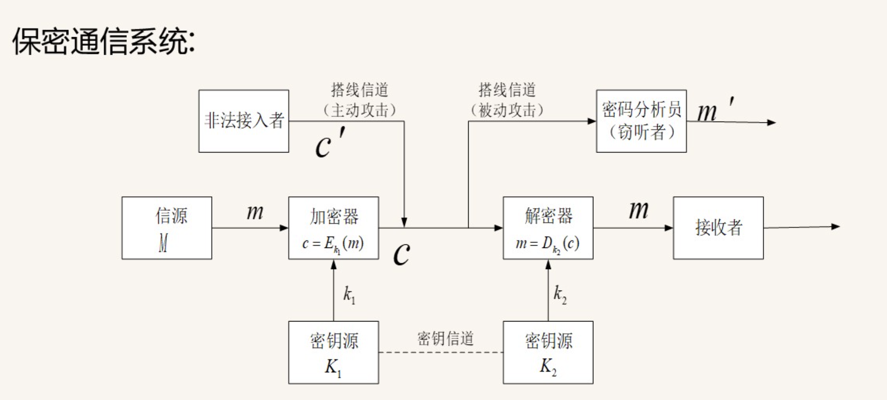
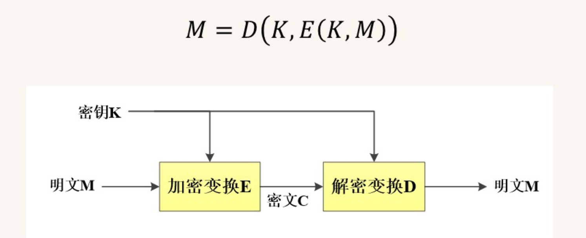
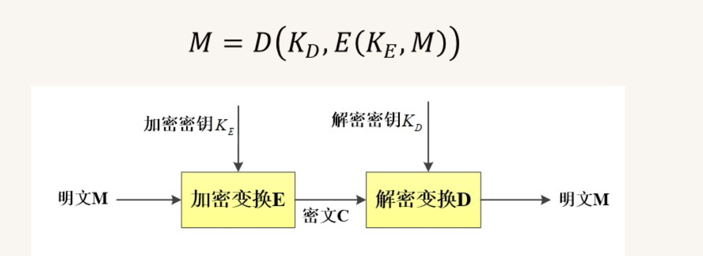

# 1 

# 2 信息安全体系结构
- 技术体系、组织体系、管理体系
## 2.1 技术体系结构概述
- 物理环境、计算机系统平台、网络通信平台、应用平台安全体系
- 物理环境安全体系
    - 通过机械强度标准的控制，使信息系统所在的建筑物、机房条件和硬件设备条件满足信息系统的机械防护安全。
- 计算机系统平台安全体系
    - 硬件安全服务、操作系统安全服务
- 网络通信平台安全体系
    - OSI安全体系
- 应用平台安全体系
## 2.2 安全机制
1. 加密
    - 对称密码和公钥密码
2. 数字签名
    - 是一类公钥密码算法
3. 访问控制
    - 访问信息库
    - 识别信息库
    - 能力信息表
    - 安全等级
4. 数据完整性
5. 身份识别
6. 通信量填充与信息隐藏
    - 通信量填充机制：为了防止敌手对通信量进行分析，需要在空闲的信道上发送一些无用的信息，以便蒙蔽敌手。
    - 信息隐藏：把一则消息隐藏到看似与之无关的消息中，以便蒙蔽敌手，
7. 路由控制
8. 公证
9. 事件监测与安全审计
10. 安全恢复
11. 安全标记
12. 保证

## OSI安全体系结构

# 3 密码技术
## 3.1 概述
- 古典加密方法（1949前）
- 古典密码体制（1949-1975）
    - 安全性基于秘钥的保密性
- 近代密码体制（1970-1990）
    - 公钥密码学 
- 现代密码体制（1990-至今）
    - IDEA替代DES算法
## 3.2 密码学基本概念
- 机密性：允许特定用户访问信息而非授权用户对信息不可理解的特点。
- 完整性：用以确保数据在存储和传输过程中不被非授权修改的特点。
- 鉴别性：与数据来源和身份识别有关的特点。
- 不可否认性：用于阻止实体间否认先前行为及相关内容的特点。
密码学基本要素：
- 明文（plaintext）：待伪装或加密的消息。用$M$表示。
- 密文（ciphertext）：对明文施加某种伪装或变换后输出的信息，用$C$表示。
- 密码算法：加解密过程中所使用的信息变换规则。
- 秘钥：密码算法中的一个可变参数，通常是满足一定条件的随机序列。
- 密码体制：五要素：消息空间M，密文空间C，秘钥空间K，加密算法E，解密算法D。

## 3.3 密码体制
- 对称密码体制：加密和解密的密钥相同。解密密钥与加密秘钥是镜像过程，又称为单钥密码体制。
- 
- 对称密码体制对明文消息的加密有两种方式：
    - 流密码：序列密码，对明文逐个加密，对数据流一次加密一位或一个字节的密码体制。
    - 分组密码：分组密码，对明文的一个数据块进行加密。
- 公钥密码体制：加密密钥与解密密钥成对出现，一个可以公开称为公钥，一个是秘密的称为私钥。又称作非对称密码体制。
- 
- 密钥管理

### 密码体制原则
    1. 安全性原则：不可破原则
        - 理论不可破
            - 密钥和明文一样长，一次一密
        - 实际不可破
            - 所需实际计算量远远超出现有资源和能力
            - 所需代价超过了所保护信息的价值
            - 所需时间超过所保护信息的有效时间
    2. 协议匹配原则：密码协议必须与计算机及通信系统的协议相匹配
    3. 实用性原则
    4. 简单性原则

### 古典密码
1. 代换密码
    - 将明文的一个字母由其他字母、数字或符号替换的一种方法。
    - 凯撒密码
2. 置换密码（换位密码）
    - 把明文的字母按一定的规律重新排列的一种方法。 