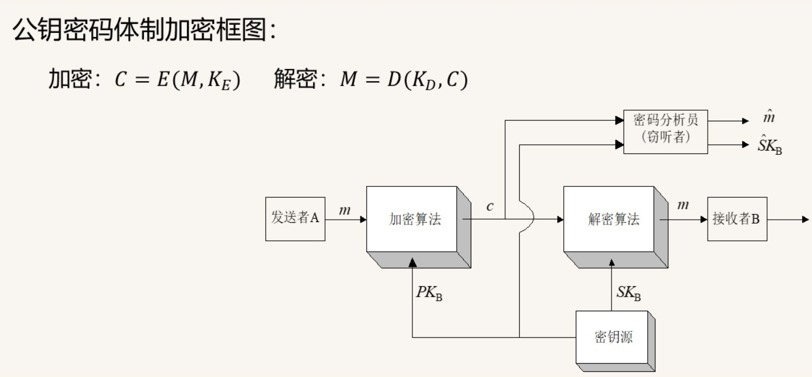

# 2 信息安全体系结构
- 技术体系、组织体系、管理体系

## 2.1 技术体系结构概述
- 物理环境、计算机系统平台、网络通信平台、应用平台安全体系
- 物理环境安全体系
    - 通过机械强度标准的控制，使信息系统所在的建筑物、机房条件和硬件设备条件满足信息系统的机械防护安全。
- 计算机系统平台安全体系
    - 硬件安全服务、操作系统安全服务
- 网络通信平台安全体系
    - OSI安全体系
- 应用平台安全体系

## 2.2 安全机制
1. 加密
    - 对称密码和公钥密码
2. 数字签名
    - 是一类公钥密码算法
3. 访问控制
    - 访问信息库
    - 识别信息库
    - 能力信息表
    - 安全等级
4. 数据完整性
5. 身份识别
6. 通信量填充与信息隐藏
    - 通信量填充机制：为了防止敌手对通信量进行分析，需要在空闲的信道上发送一些无用的信息，以便蒙蔽敌手。
    - 信息隐藏：把一则消息隐藏到看似与之无关的消息中，以便蒙蔽敌手，
7. 路由控制
8. 公证
9. 事件监测与安全审计
10. 安全恢复
11. 安全标记
12. 保证

## 2.3 OSI安全体系结构
- OSI的安全服务分为五类：
    - 鉴别：
        - 对等实体鉴别：身份识别
        - 数据原发鉴别：数据来源
    - 机密性：
        - 连接机密性
        - 无连接机密性：不保证所有连接都满足机密性
        - 选择字段机密性
        - 通信业务流机密性
    - 完整性：
        - 带恢复的连接完整性
        - 不带恢复的连接完整性
        - 选择字段的连接完整性
        - 无连接完整性
        - 选择字段的无连接完整性
    - 访问控制
    - 抗抵赖
        - 有数据原发证明的抗抵赖
        - 有交付证明的抗抵赖

- OSI安全机制
    - 特定安全机制
    - 普遍安全机制

## 2.4 应用安全体系结构
1. 安全组件
    - 系统安全组件
    - 安全通信组件
2. 安全交换
- 安全交换规范
```
2. 安全交换
    - 定义：在网络环境中安全地交换数据和信息的机制
    - 主要目标：
        - 确保数据传输的机密性
        - 保证数据的完整性
        - 验证通信双方的身份
        - 防止信息被篡改或重放
    
    - 协议桶方法
        - 概念：将安全协议分解为基本的安全服务组件，这些组件像桶一样可以被组合使用
        - 基本原理：
            - 将复杂的安全协议分解为独立的功能模块
            - 每个模块提供特定的安全服务
            - 根据需求灵活组合不同的服务模块
        
        - 主要组成部分：
            1. 安全服务桶：
                - 认证服务
                - 访问控制服务
                - 数据机密性服务
                - 数据完整性服务
                - 不可否认性服务
            
            2. 安全机制桶：
                - 加密机制
                - 数字签名机制
                - 访问控制机制
                - 数据完整性机制
                - 认证交换机制
                - 业务流填充机制
                - 路由控制机制
                - 公证机制
            
            3. 功能桶：
                - 基本功能组件
                - 安全功能组件
                - 协议功能组件
        
        - 实现方式：
            1. 垂直组合：不同层次的安全服务组合
            2. 水平组合：同一层次的不同安全服务组合
            3. 混合组合：根据具体需求进行灵活组合
        
        - 优点：
            - 模块化设计，便于组合和复用
            - 灵活性高，可根据需求选择不同服务
            - 便于维护和升级
            - 降低了协议设计的复杂度
        
        - 应用场景：
            - 安全协议设计
            - 安全系统架构
            - 安全服务集成
            - 网络通信安全
```
3. 安全变换
- 在用户数据在通信之前，要先进行一些变换，如加密、填充、签名、完整性校验等的各种组合和变体。

- 系统安全组件完成安全变换、安全通信组件完成安全交换

4. 安全关联
- 两个或多个系统实体之间，在进行相关的安全处理之前需要进行握手交换，使得他们之间共同维护着一些规则、状态信息（实体ID、选用的算法、密钥及其它参数）等属性。
- 为后续数据传输提供连贯一致的保护

## 2.5 组织体系结构和管理体系结构
1. 组织体系结构
    - 管理机构的三个层次：决策层、管理层和执行层
2. 管理体系结构
    - 法律管理、制度管理、培训管理

# 3 密码技术
## 3.1 概述
- 古典加密方法（1949前）
- 古典密码体制（1949-1975）
    - 安全性基于秘钥的保密性
- 近代密码体制（1970-1990）
    - 公钥密码学 
- 现代密码体制（1990-至今）
    - IDEA替代DES算法
## 3.2 密码学基本概念
- 机密性：允许特定用户访问信息而非授权用户对信息不可理解的特点。
- 完整性：用以确保数据在存储和传输过程中不被非授权修改的特点。
- 鉴别性：与数据来源和身份识别有关的特点。
- 不可否认性：用于阻止实体间否认先前行为及相关内容的特点。
密码学基本要素：
- 明文（plaintext）：待伪装或加密的消息。用$M$表示。
- 密文（ciphertext）：对明文施加某种伪装或变换后输出的信息，用$C$表示。
- 密码算法：加解密过程中所使用的信息变换规则。
- 秘钥：密码算法中的一个可变参数，通常是满足一定条件的随机序列。
- 密码体制：五要素：消息空间M，密文空间C，秘钥空间K，加密算法E，解密算法D。

## 3.3 密码体制
- 对称密码体制：加密和解密的密钥相同。解密密钥与加密秘钥是镜像过程，又称为单钥密码体制。
- 
- 对称密码体制对明文消息的加密有两种方式：
    - 流密码：序列密码，对明文逐个加密，对数据流一次加密一位或一个字节的密码体制。
    - 分组密码：分组密码，对明文的一个数据块进行加密。
- 公钥密码体制：加密密钥与解密密钥成对出现，一个可以公开称为公钥，一个是秘密的称为私钥。又称作非对称密码体制。
- 
- 密钥管理


### 密码体制原则
    1. 安全性原则：不可破原则
        - 理论不可破
            - 密钥和明文一样长，一次一密
        - 实际不可破
            - 所需实际计算量远远超出现有资源和能力
            - 所需代价超过了所保护信息的价值
            - 所需时间超过所保护信息的有效时间
    2. 协议匹配原则：密码协议必须与计算机及通信系统的协议相匹配
    3. 实用性原则
    4. 简单性原则

### 古典密码
1. 代换密码
    - 将明文的一个字母由其他字母、数字或符号替换的一种方法。
    - 凯撒密码
2. 置换密码（换位密码）
    - 把明文的字母按一定的规律重新排列的一种方法。 
### 对称密码体制
- 流密码：序列密码，对明文逐个加密，对数据流一次加密一位或一个字节的密码体制。
- 分组密码：分组密码，对明文的一个数据块进行加密。
#### 流密码
- 伪随机数生成器
    - 用于生成密钥流
    - 伪随机数生成器产生的密钥流应当具有良好的随机性，以确保加密的安全性。
- 同步流密码
    - 状态转移函数F与输入明文无关，加密器分为两部分：密钥流发生器和加密变换器。
- 二元加法流密码：
    - 定义：二元加法流密码是一种流密码算法，通过对明文和密钥流进行逐位异或（XOR）操作来实现加密。
    - 公式：
      - 加密：$ C_i = M_i \oplus K_i $
      - 解密：$M_i = C_i \oplus K_i $

    - 特点：
      - 加密和解密过程相同，都是通过异或操作实现
      - 需要一个高质量的伪随机密钥流生成器
      - 适用于实时数据加密，如语音和视频流
- A5算法
- RC4算法
- SCAL算法
- PKZIP算法

#### 分组密码
- 定义：分组密码是一种将明文划分为固定长度的分组，然后对每个分组进行独立加密的密码算法。
- 设计原理：
    - 扩散：将明文的信息扩散到整个分组中，使得每个分组的状态都受到影响。
    - 混淆：对分组进行复杂的非线性变换，使得分组的状态变得难以预测。
##### Feistel密码结构
- 加密流程：
    - 将明文分为两个相等的部分：左半部分 $L_0$ 和右半部分 $R_0$。
        - $P=(L_0, R_0)$
    - 经过 $n$ 轮加密，$i=1,2,3\dots,n$ 每轮使用一个轮函数 $F$ 和一个子密钥 $K_i$。
    - 每轮加密过程：
        - $L_{i+1} = R_i$
        - $R_{i+1} = L_i \oplus F(R_i, K_i)$
    - 最终输出的密文是 $L_n$ 和 $R_n$ 的组合。
        - $C = (L_n, R_n)$

- 解密流程：
    - 解密过程与加密过程类似，只需逆序使用子密钥。
    - 每轮解密过程：
        - $R_i = L_{i+1}$
        - $L_i = R_{i+1} \oplus F(L_{i+1}, K_i)$
    - 最终输出的明文是 $L_0$ 和 $R_0$ 的组合。
        - $P = (L_0, R_0)$
- Feistel密码的实现与以下参数和特性有关：
    - 分组大小：分组大小越大，密码的安全性越高，但处理速度可能越慢。
    - 密钥大小：密钥越长，密码的安全性越高，但密钥管理的复杂性也可能越高。
    - 轮数：轮数越多，密码的安全性越高，但计算复杂度也可能越高。
    - 子密钥生成算法：算法越复杂，生成的子密钥越难以预测，安全性越高。
    - 轮函数：轮函数越复杂，密码的混淆和扩散效果越好，安全性越高。
##### DES密码
- 定义：DES（数据加密标准）是一种对称分组密码算法，使用固定长度的分组和密钥进行加密。

- 加密流程：
    1. **初始置换（$IP$）**：
        - 将64位明文进行初始置换，得到置换后的数据。
        - 公式表示：$IP(P) = (L_0, R_0)$

    2. **16轮Feistel结构加密**：
        - 每轮使用一个子密钥 $K_i$。
        - 每轮加密过程：
            - $L_{i+1} = R_i$
            - $R_{i+1} = L_i \oplus F(R_i, K_i)$
        - 公式表示：$C = (L_{16}, R_{16})$

    3. **逆初始置换（$IP^{-1}$）**：
        - 将加密后的数据进行逆初始置换，得到最终的密文。
        - 公式表示：$IP^{-1}(C)$

- 解密流程：
    1. **初始置换（$IP$）**：
        - 将64位密文进行初始置换，得到置换后的数据。
        - 公式表示：$IP(C) = (L_{16}, R_{16})$

    2. **16轮Feistel结构解密**：
        - 每轮使用一个子密钥 $K_i$，顺序与加密相反。
        - 每轮解密过程：
            - $R_i = L_{i+1}$
            - $L_i = R_{i+1} \oplus F(L_{i+1}, K_i)$
        - 公式表示：$P = (L_0, R_0)$

    3. **逆初始置换（$IP^{-1}$）**：
        - 将解密后的数据进行逆初始置换，得到最终的明文。
        - 公式表示：$IP^{-1}(P)$

- 特性：
    - 分组大小：64位。
    - 密钥大小：56位（实际使用64位，其中8位用于奇偶校验）。
    - 轮数：16轮。
    - 安全性：由于密钥长度较短，DES已被认为不够安全，通常被3DES或AES替代。
- DES加密算法的轮结构：
    - 每轮操作包括以下步骤：
        1. **扩展置换（E）**：
            - 将32位的右半部分扩展为48位，以便与子密钥进行异或操作。
            - 公式表示：$E(R_i)$

        2. **与子密钥异或（XOR）**：
            - 将扩展后的右半部分与48位子密钥 $K_i$ 进行异或操作。
            - 公式表示：$B_i = E(R_i) \oplus K_i$

        3. **S盒替换（S-box）**：
            - 将异或结果分为8组，每组6位，通过S盒进行替换，得到32位输出。
            - 公式表示：$S(B_i)$

        4. **置换（P）**：
            - 对S盒输出进行置换，得到最终的32位结果。
            - 公式表示：$P(S(B_i))$

        5. **与左半部分异或（XOR）**：
            - 将置换结果与左半部分进行异或，得到新的右半部分。
            - 公式表示：$R_{i+1} = L_i \oplus P(S(B_i))$

    - 通过16轮的上述操作，最终得到加密后的数据。
- 两个密钥的三重DES算法：
    - 三重DES算法是DES算法的一种扩展，使用两个不同的密钥对数据进行三次加密。
- 三个密钥的三重DES算法：
    - 三重DES算法是DES算法的一种扩展，使用三个不同的密钥对数据进行三次加密。
### 公钥密码体制
- 公钥密码
- 
- 公钥密码算法：
    - 基于大整数分解问题： 
        - RSA算法
        - Rabin算法
    - ElGamal算法
    - Diffie-Hellman算法
    - 椭圆曲线密码算法（ECC）
#### RSA算法
- 基于因子分解的困难之上
- 基于可逆的模指数运算
- 算法流程
    1. 算法初始化
        - 产生两个大素数，计算$N=pq$，其中$N$是公开的，$q$是保密的。
        - 计算$(p-1)(q-1)$，并选择与结果互质的整数$e$，$(0<e<(p-1)(q-1))$。
        - 求解$(p-1)(q-1)$的$e$的乘法逆$d$，使得$ed\equiv1(mod(p-1)(q-1))$。
        - 销毁$p$和$q$，得到RSA的密钥对：
            - 公钥：$K_E:(N,e)$
            - 私钥：$K_D:(N,d)$

    2. 加密
        - 明文$M$，加密后得到密文$C$。
        - 加密过程：$C=M^e(modN)$

        - 密文$C$，解密后得到明文$M$。
        - 解密过程：$M=C^d(modN)$
##### 加解密数学原理讲解
RSA解密过程的成立依赖于数论中的**欧拉定理**和**模逆元**的数学特性。以下是核心原理的分步解释：

---

###### **1. 核心公式与参数关系**
- **已知条件**：
  - 加密公式：$C = M^e \mod N$
  - 解密公式：$M = C^d \mod N = (M^e)^d \mod N = M^{ed} \mod N$
- **关键约束**：  
  加密指数 $e$ 和解密指数 $d$ 需满足 $ed \equiv 1 \mod \phi(N)$，其中 $\phi(N)$ 是欧拉函数。  
  （例如，若 $N = p \cdot q$ 且 $p, q$ 为质数，则 $\phi(N) = (p-1)(q-1)$）

---

###### **2. 欧拉定理的应用**
根据欧拉定理，若 $M$ 与 $N$ 互质（即 $\gcd(M, N) = 1$），则有：
$$
M^{\phi(N)} \equiv 1 \mod N
$$
这一性质表明，对 $M$ 进行 $\phi(N)$ 次幂后再取模 $N$，结果仍为原值。

---

###### **3. 构造指数 $ed$ 的特殊性**
由于 $ed \equiv 1 \mod \phi(N)$，可设 $ed = k\phi(N) + 1$，其中 $k$ 为整数。  
将 $ed$ 代入解密公式：
$$
M^{ed} \mod N = M^{k\phi(N) + 1} \mod N = \left(M^{\phi(N)}\right)^k \cdot M \mod N
$$
根据欧拉定理，$M^{\phi(N)} \equiv 1 \mod N$，因此：
$$
\left(1\right)^k \cdot M \mod N = M \mod N = M
$$

---

###### **4. 特殊情况下的处理**
当 $M$ 与 $N$ 不互质时（如 $M$ 是 $p$ 或 $q$ 的倍数），需单独讨论：
- 若 $M = p$ 或 $M = q$，可通过中国剩余定理结合模运算特性恢复明文。
- 实际应用中，通常会限制消息 $M < N$，并确保其与 $N$ 互质，以避免此类边界问题。

---

###### **5. 安全性支撑**
- **密钥生成**：$e$ 和 $d$ 的生成基于 $\phi(N)$，而 $\phi(N)$ 的计算依赖于分解 $N$ 为两个大质数 $p$ 和 $q$。
- **抗攻击性**：若攻击者无法高效分解 $N$，则无法获取 $\phi(N)$，从而无法推导出 $d$，保障了加密体系的安全。

---

###### **总结**
RSA解密的成立本质上是利用了**欧拉定理的周期性**和**指数运算的同余性质**，通过精心设计的 $e$ 和 $d$ 的关系，使得经过两次模幂运算后能精确还原原始明文。整个过程既保证了计算效率，又依托于数论难题提供了安全性。

        - 反复平方乘算法

#### Diffie-Hellman算法
- 基于离散对数问题
- 基于模运算
- 用于用户建立共享的秘密
- 算法流程
    1. 算法初始化
        - 令$p$为一个大素数，$g$为生成元，$p$和$g$是公开的。
        - 对于任意$x\in\{1,p-1\}$，找到指数$n$，使得$$x\equiv g^n(modp)$$
    2. 密钥交换过程
        - 对于$A$和$B$，分别选择$a$和$b$，计算$A=g^a(modp)$ 和 $B=g^b(modp)$，并将$A$和$B$交换。
        - 对于$A$和$B$，计算$$K_A=g^{ab}(modp)$$和$$K_B=g^{ba}(modp)$$，并将$K_A$和$K_B$交换。
        - $g^{ab}mod \ p$就是共享的秘密。
###---

##### **Diffie-Hellman算法数学原理详解**

Diffie-Hellman算法的核心是通过**模幂运算**和**离散对数问题**实现安全的密钥交换。以下是其数学原理的分步拆解：

---

###### **1. 基础参数设定**
- **公开参数**：  
  双方预先协商两个公开的数：  
  - **大素数 $p$**（模数）  
  - **原根 $g$**（生成元，满足 $g$ 的幂次可覆盖模 $p$ 的所有非零数）  
  这些参数公开，无需保密。

- **私有密钥**：  
  双方各自随机选择一个私有整数：  
  - Alice选择 $a$（私钥），Bob选择 $b$（私钥）。  
  要求 $1 < a, b < p-1$，且均为保密值。

---

###### **2. 公钥生成与交换**
- **Alice计算公钥**：  
  $A = g^a \mod p$  
  将 $A$ 发送给 Bob。

- **Bob计算公钥**：  
  $B = g^b \mod p$  
  将 $B$ 发送给 Alice。

**安全性保障**：  
即使攻击者截获 $A$ 和 $B$，也无法直接推导出 $a$ 或 $b$，因为从 $g^a \mod p$ 反向求解 $a$ 是典型的**离散对数问题**，在计算上不可行。

---

###### **3. 共享密钥的生成**
- **Alice计算共享密钥**：  
  使用 Bob 的公钥 $B$，计算：  
  $S = B^a \mod p = (g^b)^a \mod p = g^{ab} \mod p$

- **Bob计算共享密钥**：  
  使用 Alice 的公钥 $A$，计算：  
  $S = A^b \mod p = (g^a)^b \mod p = g^{ab} \mod p$

**结果一致性**：  
双方最终得到相同的共享密钥 $S = g^{ab} \mod p$，但攻击者无法通过 $g, p, A, B$ 高效计算 $S$。

---

###### **4. 离散对数问题的核心作用**
- **正向计算容易**：  
  已知 $g, a, p$，计算 $g^a \mod p$ 是快速幂运算，复杂度仅为 $O(\log a)$。

- **逆向计算困难**：  
  已知 $g, p, g^a \mod p$，求解 $a$ 需要解决**离散对数问题**，目前没有多项式时间算法，尤其当 $p$ 为大素数时，计算成本极高。

---

###### **5. 实际应用中的安全性增强**
- **参数选择**：  
  - $p$ 需足够大（通常为2048位以上），防止暴力破解。  
  - $g$ 应为原根，确保其幂次覆盖模 $p$ 的所有非零数。

- **前向安全性**：  
  即使长期私钥泄露，历史会话的共享密钥仍安全，因为每次会话的临时私钥 $a, b$ 是随机生成的。

---

###### **总结**
Diffie-Hellman算法通过**模幂运算的可交换性**和**离散对数问题的难解性**，实现了安全的密钥交换。其数学本质是：  
1. **公开参数**：所有人可见的 $g$ 和 $p$。  
2. **私有密钥**：用户秘密选择的 $a$ 或 $b$。  
3. **共享密钥**：通过 $g^{ab} \mod p$ 生成，仅双方可推导。  

这种设计使得攻击者即使截获所有通信数据，也无法高效破解共享密钥，从而保障了通信安全。
####  椭圆曲线密码算法
- 计算量小、处理速度快、存储空间占用小，很容易使用到小的有限资源设备中，如智能卡。

## 3.4 密钥管理与分配
- 关键步骤
    - 密钥生成
    - 密钥分配
    - 密钥验证
    - 更新密钥

### 密钥分配
1. 密钥由A选取并通过物理手段发送给B
2. 密钥由第三方选取并通过物理手段发送给A和B
3. 如果A、B事先已有一密钥，则其中一方选取新密钥后，用已有的密钥加密新密钥并发送给另一方。
4. 如果A、B与第三方C分别有一保密信道，则C为A、B选取密钥后，分别在两个保密信道上发送给A、B。

- 有中心的密钥分配
- 无中心的密钥分配
