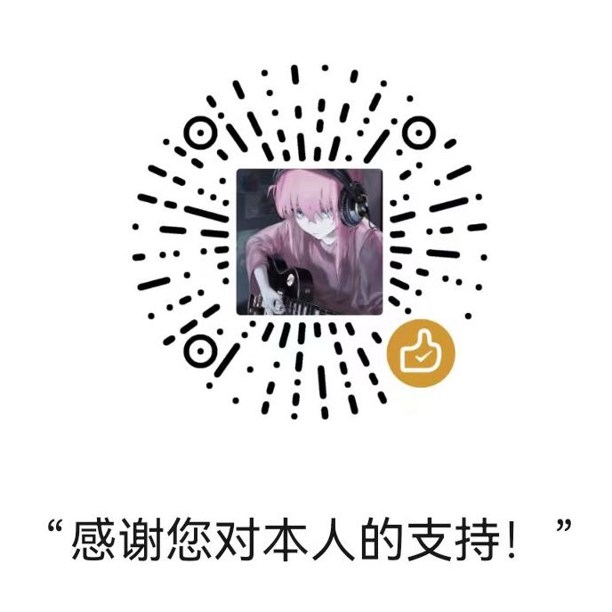

## 关于我
你好，我是KIOSHIROI，你也可以叫我余秋白、秋白。
一位北京师范大学（珠海）人工智能专业在读本科生。喜欢学一些乱七八糟的东西，尝试在一所师范大学中学到更多的计算机知识。

## 教育经历

  

    中国科学院大学 · 杭州高等研究院
    推免录取
  

  
硕士研究生（拟录取）· 人工智能

  
已保研至国科大杭州高等研究院。

  

    北京师范大学（珠海）
    本科在读
  

  
人工智能

  
本科阶段学习与科研积累中。

## 致谢
感谢[程序员柠檬](https://www.zhihu.com/people/ning-meng-cheng-31-94)提供的web模板帮助。

[教程链接](https://lemonchann.github.io/create_blog_with_github_pages/)

# 赞赏
如果您喜欢本人的创作，可以请我喝一杯下午茶吗ღ( ´･ᴗ･` )

## 版权声明
本博客_post文件夹中文章均为作者原创，搬运请注明来处。
